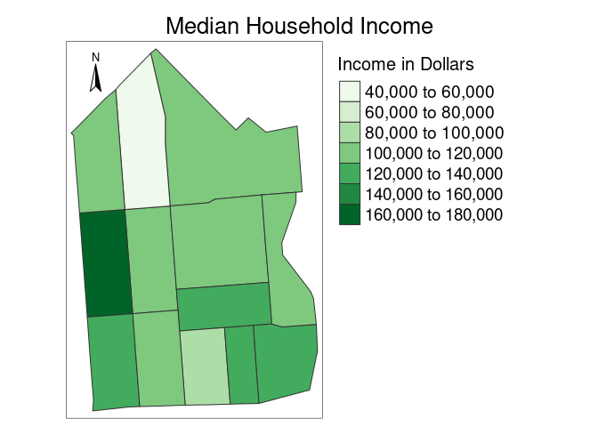
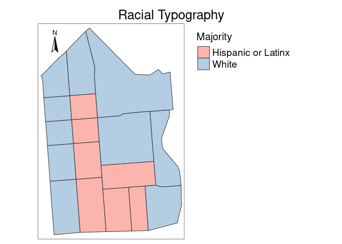
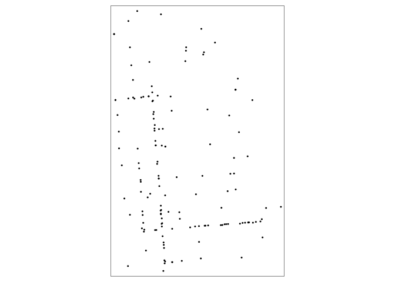
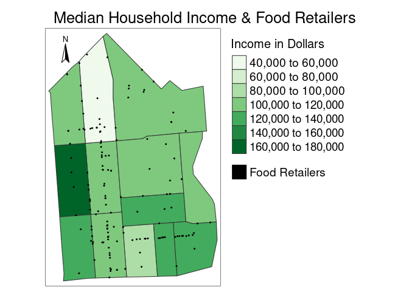

Final Project: The Socioeconomic and Food Reatil Landscape of San
Francisco’s Mission District
================

By: Fischer Heimburger (@fheimburger97) & Caroline Mahdavi (@cmahdavi)

# Introduction

The Mission District (known as “This Mission”) in San Francisco known
for it’s widening economic inequity, relatively high ethnic
diversity–including being a local hub for Latinx culture and heritage,
and vibrant food scene. This research seeks to first cultivate an
understanding of the socio-economic landscape of the Mission District,
and then initiate research on how this landscape is reflected in the
distribution of food retailers.

Economic inequity is a major challenge facing the Mission District
today. In 2020, it was found that “the highest and lowest income
brackets compose almost 40% of all Mission households” ([Mission Action
Plan
2020](https://default.sfplanning.org/Citywide/Mission2020/MAP2020_Status_Report_2018.pdf).
This demonstrates the increasing income gap experienced in the Mission
District. In addition, the economic landscape of the Mission District is
highly influenced by gentrification–the process by which the migration
of high-income residents to a place displaces low-income, often
marginalized, residents ([Chapple and Thomas
2021](https://www.urbandisplacement.org/about/what-are-gentrification-and-displacement/)).
San Francisco was recently found to be the most intensely gentrified
city in America ([Richardson, Mitchell, and Edlebi
2020](https://ncrc.org/gentrification20/)) and the Mission District, one
of the neighborhoods with the most advanced levels of gentrification
([Chapple and Thomas
2021](https://www.urbandisplacement.org/about/what-are-gentrification-and-displacement/)).
We hope to understand this unique and stark economic landscape by
mapping out median household incomes by census tract within the Mission
District. Our research on this is influenced by data and figures from
the [Urban Displacement Project](https://www.urbandisplacement.org/).
The Urban Displacement Project traces gentrification throughout the San
Francisco Bay Area. As a part of their studies, they gather data on
median income levels within the Mission District and map out their
findings. We hope, in part, to recreate aspects of their figures with
updated census data.

While much of the Bay Area is growing more racially segregated
([Menendian, Gambhir and Gailes
2021](https://belonging.berkeley.edu/roots-structural-racism)), The
Mission is unique for its relatively high ethnic diversity ([Hom
2021](https://missionlocal.org/2021/07/the-mission-isnt-as-racially-segregated-as-the-bay-does-that-point-to-gentrification)).
While overall in 2019 the Mission District was 38.7% Latinx, 36.4%
White, and 13.7% Asian ([City Data
2021](https://www.city-data.com/neighborhood/Mission-District-San-Francisco-CA.html));
the demographic makeup of race varies depending on locale ([Hom
2021](https://missionlocal.org/2021/07/the-mission-isnt-as-racially-segregated-as-the-bay-does-that-point-to-gentrification)).
Additionally, recent years have shown dynamic shifts in demographics as
the 2020 Census revealed a 14.4% decline in Latinx residents within the
Mission District and a 34.8% increase in Asian residents ([Horowitz and
Jarret
2021](https://missionlocal.org/2021/09/census-2020-as-san-francisco-grew-the-ethnic-makeup-of-its-neighborhoods-changed-heres-how)).
The [Othering & Belonging
Institute](https://belonging.gis-cdn.net/us_segregation_map/?year=2020)
researches levels of segregation in the San Francisco Bay Area. As part
of their research, they have created maps of the Mission District that
display levels of segregation and racial diversity. We seek to create
similar maps that display racial majorities by census tract to further
understand the demographic landscape of The Mission. We then hope to
understand how these socio-economic landscapes interact the landscape of
food retailers in the Mission District.

Food systems are complex, interconnected bio-physical and socio-economic
webs that are influenced by environmental, social, political, and
economic systems, institutions, and actors ([Ericksen
2008](https://doi.org/10.1016/j.gloenvcha.2007.09.002)). For many living
in cities, like those within the Mission District, relationships with
food systems revolve around food retailers—including supermarkets,
grocery stores, corner markets, and convenience stores—that help connect
food producers with food consumers ([Trivette
2019](https://link.springer.com/article/10.1007/s10460-018-9885-1)).
Using data from the [City of San
Francisco](https://datasf.org/opendata/), we hope to map out the current
distribution of food retailers in the Mission District. Then we seek to
understand how this distribution may be interconnected with class and
race.

Our research is organized as follows. First, we map out income levels by
census tract in the Mission District. Second, we map out racial
majorities by census tract in The Mission. We then create a demographic
table that organizes the socio-economic landscape of the district. In
the fourth section we map out the distribution of food retailers within
the Mission District. Lastly, we overlay the socio-economic maps with
the food retailer map.

#### Data note: We used the following libraries to analyze our data. Additionally, please run `install.packages("tidycensus")` in the console window.

Google API Key – need to upload key
\#`{r} register_google(key = "", write = TRUE) #`

## I Tract Income Typology

#### Table 1.1: Downloading San Francisco’s Geopackage

First, we downloaded the [geopackage for San
Francisco](https://github.com/urban-displacement/displacement-typologies/tree/main/data/downloads_for_public).
In the following chunk, we load the geopackage using `read_sf` and
`filter` for census tracts in the Mission District. We `select` to show
“GEOID” and “geom” which will help create our map.

``` r
gfile <- read_sf("sanfrancisco.gpkg") %>%
  select(GEOID, geom) %>%
  filter(GEOID == "6075020200" | GEOID == "6075020100" | GEOID == "6075020800" | GEOID == "6075020700" | GEOID == "6075022902" | GEOID == "6075020900" | GEOID == "6075017700" | GEOID == "6075022901" | GEOID == "6075022803" | GEOID == "6075022903" | GEOID == "6075022801" | GEOID == "6075021000" | GEOID == "6075022802")
```

#### Table 1.2: Downloading San Francisco’s Demographics

We then use `read.csv` to load typology data from the [Urban
Displacement Project
github](https://github.com/urban-displacement/displacement-typologies/tree/main/data/outputs/typologies).
The definitions for variable names can be found
[here](https://github.com/urban-displacement/displacement-typologies/blob/main/data/outputs/typologies/typologies_codebook.md).

``` r
demographics <- read.csv("https://raw.githubusercontent.com/urban-displacement/displacement-typologies/main/data/outputs/typologies/SanFrancisco_typology_output.csv")
```

#### Table 1.3: Median Household Income Table

First, we create the **medianincome** table which shows “GEOID” and
“hinc_18”; “hinc_18” is the median household income in the past 12
months (in 2018 inflation-adjusted dollars) in 2018. Second, with
`left_join`, we join the newly created **medianincome** table and the
initial **gfile** table to create our **incomejoin** table.

``` r
medianincome <- demographics %>%
  select(GEOID, hinc_18) %>%
  rename("Income in Dollars" = hinc_18)
incomejoin <-left_join(gfile, medianincome, by = "GEOID")
incomejoin
```

    ## # A tibble: 13 × 3
    ##         GEOID                                              geom `Income in Dol…`
    ##         <dbl>                                <MULTIPOLYGON [°]>            <dbl>
    ##  1 6075020800 (((-122.4217 37.7633, -122.4173 37.76357, -122.4…           103134
    ##  2 6075017700 (((-122.4187 37.77564, -122.4156 37.7731, -122.4…           114722
    ##  3 6075020700 (((-122.4261 37.76304, -122.4217 37.7633, -122.4…           167422
    ##  4 6075020100 (((-122.4226 37.7725, -122.4222 37.77291, -122.4…            46750
    ##  5 6075022801 (((-122.4173 37.76357, -122.4136 37.76382, -122.…           117368
    ##  6 6075022803 (((-122.4167 37.75717, -122.4078 37.75771, -122.…           123000
    ##  7 6075022903 (((-122.4093 37.7544, -122.4074 37.75451, -122.4…           128750
    ##  8 6075021000 (((-122.4254 37.75503, -122.421 37.75529, -122.4…           138523
    ##  9 6075022901 (((-122.4164 37.75397, -122.412 37.75423, -122.4…            91464
    ## 10 6075020200 (((-122.4269 37.76917, -122.4264 37.7696, -122.4…           100099
    ## 11 6075022802 (((-122.4084 37.76443, -122.4051 37.76463, -122.…           102750
    ## 12 6075020900 (((-122.421 37.75529, -122.4187 37.75544, -122.4…           106875
    ## 13 6075022902 (((-122.412 37.75423, -122.4093 37.7544, -122.40…           133239

#### Figure 1.1: Mapping Median Household Income in the Mission District

Using **tmap** and our **incomejoin** table, we then create a map
showing median household income across census tracts in the Mission
District.

``` r
incomemap <- tm_shape(incomejoin) +
             tm_style("watercolor") +
             tm_polygons("Income in Dollars") +
             tm_layout(main.title="Median Household Income",
                       main.title.position = "centre",
                       main.title.size = 1.6) +
             tm_legend(position = c("right", "top"),
             legend.outside = TRUE,
             legend.outside.size = .35,
             legend.title.size = 1.5,
             legend.text.size = 1.2) +
  tm_compass(position = c("left", "top"))
incomemap
```

<!-- -->

## II Tract Racial Typology

To work with census data, we install **tidycensus** from CRAN with the
following command: `install.packages("tidycensus")`. After loading the
**tidycensus** and **tidyverse** libraries, obtain a [Census API
key](http://api.census.gov/data/key_signup.html). Note: 2020 decennial
Census data use differential privacy, a technique that introduces errors
into data to preserve respondent confidentiality, small counts should be
interpreted with caution.

``` r
census_api_key("77bb8e57772d9321db5adcd03b9bf2c3bce563c3", install = TRUE, overwrite = TRUE)
```

    ## [1] "77bb8e57772d9321db5adcd03b9bf2c3bce563c3"

#### Table 2.1 Population Numbers by Race

Using **tidycensus**, we will get the values for four variables: total
population, White population, Asian population, and Hispanic or Latino
population. The argument to the `geography` parameter is “tract”, and by
by specifying `state`, `county`, and `year` we get the desired
population numbers for each census tract in San Francisco from 2020.
Note that `geometry` is set to true in the first table to help create
maps later.

``` r
#White Population
white <- get_decennial(geography = "tract",
                      state = "CA",
                      county = "San Francisco",
                      year = 2020,
                      variables = c(white = "P1_003N"))
#Asian Population
asian <- get_decennial(geography = "tract",
                      state = "CA",
                      county = "San Francisco",
                      year = 2020,
                      variables = c(asian = "P1_006N"))
#Hispanic or Latino Population
latinx <- get_decennial(geography = "tract",
                      state = "CA",
                      county = "San Francisco",
                      year = 2020,
                      variables = c(latinx = "P2_002N"))
#Total Population
totalpop <- get_decennial(geography = "tract",
                      state = "CA",
                      county = "San Francisco",
                      year = 2020,
                      variables = c(totalpop = "P1_002N"),
                      geometry = TRUE)
```

    ##   |                                                                              |                                                                      |   0%  |                                                                              |                                                                      |   1%  |                                                                              |=                                                                     |   1%  |                                                                              |=                                                                     |   2%  |                                                                              |==                                                                    |   2%  |                                                                              |==                                                                    |   3%  |                                                                              |===                                                                   |   4%  |                                                                              |===                                                                   |   5%  |                                                                              |====                                                                  |   5%  |                                                                              |====                                                                  |   6%  |                                                                              |=====                                                                 |   7%  |                                                                              |=====                                                                 |   8%  |                                                                              |======                                                                |   8%  |                                                                              |======                                                                |   9%  |                                                                              |=======                                                               |   9%  |                                                                              |=======                                                               |  10%  |                                                                              |========                                                              |  11%  |                                                                              |========                                                              |  12%  |                                                                              |=========                                                             |  12%  |                                                                              |=========                                                             |  13%  |                                                                              |==========                                                            |  14%  |                                                                              |==========                                                            |  15%  |                                                                              |===========                                                           |  16%  |                                                                              |============                                                          |  17%  |                                                                              |============                                                          |  18%  |                                                                              |=============                                                         |  19%  |                                                                              |==============                                                        |  19%  |                                                                              |==============                                                        |  20%  |                                                                              |==============                                                        |  21%  |                                                                              |===============                                                       |  22%  |                                                                              |================                                                      |  22%  |                                                                              |=================                                                     |  25%  |                                                                              |==================                                                    |  25%  |                                                                              |====================                                                  |  29%  |                                                                              |=====================                                                 |  30%  |                                                                              |=============================================                         |  65%  |                                                                              |======================================================================| 100%

#### Table 2.2: Race Percents

Next, with a series of `left_join`, we join the four previous tables by
“GEOID”. We `rename` and `select` several important variables for
neatness and clarity. We use `mutate` to add three columns displaying
the percentage of the total population that each race is.

``` r
totalandwhite <- left_join(totalpop, white, by = "GEOID") %>%
    rename(tract = NAME.x,
           totalvar = variable.x,
           totalval = value.x,
           whitevar = variable.y,
           whiteval = value.y) %>%
  select(GEOID, tract, totalvar, totalval, whitevar, whiteval)
asianandlatinx <- left_join(asian, latinx, by = "GEOID") %>%
    rename(tract = NAME.x,
           asianvar = variable.x,
           asianval = value.x,
           latinxvar = variable.y,
           latinxval = value.y) %>%
  select(GEOID, asianvar, asianval, latinxvar, latinxval)
racetable <- left_join(totalandwhite, asianandlatinx, by = "GEOID") %>%
  mutate(percwhite = (whiteval/totalval)*100) %>%
  mutate(percasian = (asianval/totalval)*100) %>%
  mutate(perclatinx = (latinxval/totalval)*100)
racetable
```

    ## # A tibble: 244 × 14
    ##    GEOID     tract totalvar totalval whitevar whiteval                  geometry
    ##    <chr>     <chr> <chr>       <dbl> <chr>       <dbl>        <MULTIPOLYGON [°]>
    ##  1 06075035… Cens… totalpop     3888 white        1957 (((-122.5099 37.76409, -…
    ##  2 06075040… Cens… totalpop     3936 white        2354 (((-122.4648 37.78856, -…
    ##  3 06075047… Cens… totalpop     3527 white        1582 (((-122.4887 37.77611, -…
    ##  4 06075026… Cens… totalpop     3852 white         260 (((-122.4113 37.71061, -…
    ##  5 06075012… Cens… totalpop     3088 white        1566 (((-122.4154 37.78932, -…
    ##  6 06075020… Cens… totalpop     3247 white        2238 (((-122.4352 37.76273, -…
    ##  7 06075021… Cens… totalpop     2620 white        2106 (((-122.4428 37.75238, -…
    ##  8 06075026… Cens… totalpop     2902 white         818 (((-122.4318 37.72825, -…
    ##  9 06075025… Cens… totalpop     4182 white         551 (((-122.4105 37.72849, -…
    ## 10 06075032… Cens… totalpop     3979 white        1553 (((-122.4848 37.76516, -…
    ## # … with 234 more rows, and 7 more variables: asianvar <chr>, asianval <dbl>,
    ## #   latinxvar <chr>, latinxval <dbl>, percwhite <dbl>, percasian <dbl>,
    ## #   perclatinx <dbl>

#### Table 2.3: Race Percents and Majorities

Next, we `mutate` to add a “majority” column. In this column, we use
`case_when` to show which of the three races has the highest percent of
the population, and thus, is the majority of its tract.

``` r
percents <- racetable  %>% 
  mutate(Majority = case_when(
    perclatinx > percasian & perclatinx > percwhite ~ "Hispanic or Latinx",
    percwhite > percasian & percwhite > perclatinx ~ "White",
    percasian > percwhite & percasian > perclatinx ~ "Asian")) %>%
  select(GEOID, tract, percwhite, percasian, perclatinx, Majority, geometry)
```

#### Table 2.4: Specifying the Boundaries

To narrow our scope, we then `filter` to only include census tracts in
the Mission District of San Francisco.

``` r
mission_geo_zero <- percents %>% pull(GEOID)
mission_percents_clean <- percents %>%
  mutate(GEOID = substring(mission_geo_zero, 2)) %>%
  filter(GEOID == "6075020201" | GEOID == "6075020202" | GEOID == "6075020101" | GEOID == "6075020102" | GEOID == "6075020801" | GEOID == "6075020802" | GEOID == "6075020701" | GEOID == "6075020702" | GEOID == "6075022902" | GEOID == "6075020900" | GEOID == "6075017700" | GEOID == "6075022901" | GEOID == "6075022803" | GEOID == "6075022903" | GEOID == "6075022801" | GEOID == "6075021000" | GEOID == "6075022802")
mission_percents_clean
```

    ## # A tibble: 17 × 7
    ##    GEOID tract percwhite percasian perclatinx Majority                  geometry
    ##    <chr> <chr>     <dbl>     <dbl>      <dbl> <chr>           <MULTIPOLYGON [°]>
    ##  1 6075… Cens…      41.7      25.2       35.5 White    (((-122.4226 37.7725, -1…
    ##  2 6075… Cens…      35.6      20.9       45.2 Hispani… (((-122.422 37.76654, -1…
    ##  3 6075… Cens…      72.8      14.3       18.0 White    (((-122.4258 37.75984, -…
    ##  4 6075… Cens…      44.4      17.8       49.4 Hispani… (((-122.421 37.75529, -1…
    ##  5 6075… Cens…      37.7      11.6       61.6 Hispani… (((-122.4164 37.75397, -…
    ##  6 6075… Cens…      38.0      18.8       54.5 Hispani… (((-122.4217 37.7633, -1…
    ##  7 6075… Cens…      51.9      24.1       29.9 White    (((-122.4265 37.76627, -…
    ##  8 6075… Cens…      48.8      17.1       47.8 White    (((-122.4093 37.7544, -1…
    ##  9 6075… Cens…      47.6      26.0       32.8 White    (((-122.4084 37.76443, -…
    ## 10 6075… Cens…      66.5      20.9       20.1 White    (((-122.4261 37.76304, -…
    ## 11 6075… Cens…      68.2      17.5       21.8 White    (((-122.4254 37.75503, -…
    ## 12 6075… Cens…      45.0      16.2       53.4 Hispani… (((-122.412 37.75423, -1…
    ## 13 6075… Cens…      44.9      19.6       46.9 Hispani… (((-122.4214 37.7601, -1…
    ## 14 6075… Cens…      46.2      23.2       30.2 White    (((-122.4187 37.77564, -…
    ## 15 6075… Cens…      48.3      17.3       41.6 White    (((-122.4173 37.76357, -…
    ## 16 6075… Cens…      52.7      26.1       25.8 White    (((-122.4269 37.76917, -…
    ## 17 6075… Cens…      46.5      15.4       51.5 Hispani… (((-122.4167 37.75717, -…

#### Figure 2.1: Mapping Racial Majorities in the Mission District

-   

``` r
racemap <-
  tm_shape(mission_percents_clean) +
  tm_polygons("Majority") +
  tm_style("watercolor") +
  tm_layout(main.title = "Racial Typography",
            main.title.position = "centre",
            main.title.size = 1.6) +
  tm_legend(position = c("right", "top"),
            legend.outside = TRUE,
            legend.outside.size = .35,
            legend.title.size = 1.5,
            legend.text.size = 1.2) +
  tm_compass(position = c("left", "top"))
racemap
```

<!-- -->

## III Demographics Table

#### Table 3.1

``` r
incomejoin_chr <- incomejoin %>%
  mutate_at("GEOID", as.character)
incomejoin_chr
```

    ## # A tibble: 13 × 3
    ##    GEOID                                                   geom `Income in Dol…`
    ##    <chr>                                     <MULTIPOLYGON [°]>            <dbl>
    ##  1 6075020800 (((-122.4217 37.7633, -122.4173 37.76357, -122.4…           103134
    ##  2 6075017700 (((-122.4187 37.77564, -122.4156 37.7731, -122.4…           114722
    ##  3 6075020700 (((-122.4261 37.76304, -122.4217 37.7633, -122.4…           167422
    ##  4 6075020100 (((-122.4226 37.7725, -122.4222 37.77291, -122.4…            46750
    ##  5 6075022801 (((-122.4173 37.76357, -122.4136 37.76382, -122.…           117368
    ##  6 6075022803 (((-122.4167 37.75717, -122.4078 37.75771, -122.…           123000
    ##  7 6075022903 (((-122.4093 37.7544, -122.4074 37.75451, -122.4…           128750
    ##  8 6075021000 (((-122.4254 37.75503, -122.421 37.75529, -122.4…           138523
    ##  9 6075022901 (((-122.4164 37.75397, -122.412 37.75423, -122.4…            91464
    ## 10 6075020200 (((-122.4269 37.76917, -122.4264 37.7696, -122.4…           100099
    ## 11 6075022802 (((-122.4084 37.76443, -122.4051 37.76463, -122.…           102750
    ## 12 6075020900 (((-122.421 37.75529, -122.4187 37.75544, -122.4…           106875
    ## 13 6075022902 (((-122.412 37.75423, -122.4093 37.7544, -122.40…           133239

#### Table 3.2: Demographics Table

``` r
finaljoin <- right_join(st_drop_geometry(incomejoin_chr), st_drop_geometry(mission_percents_clean), by = "GEOID") %>% 
  select(GEOID, tract, "Income in Dollars", Majority, percwhite, perclatinx, percasian) %>% 
  rename("Median Income ($)" = "Income in Dollars", Tract = tract, "White Percentage" = percwhite, "Hispanic/Latinx Percentage" = perclatinx, "Asian Percentage" = percasian, "Racial Majority" = Majority)
finaljoin
```

    ## # A tibble: 17 × 7
    ##    GEOID      Tract           `Median Income…` `Racial Majori…` `White Percent…`
    ##    <chr>      <chr>                      <dbl> <chr>                       <dbl>
    ##  1 6075017700 Census Tract 1…           114722 White                        46.2
    ##  2 6075022801 Census Tract 2…           117368 White                        48.3
    ##  3 6075022803 Census Tract 2…           123000 Hispanic or Lat…             46.5
    ##  4 6075022903 Census Tract 2…           128750 White                        48.8
    ##  5 6075021000 Census Tract 2…           138523 White                        68.2
    ##  6 6075022901 Census Tract 2…            91464 Hispanic or Lat…             37.7
    ##  7 6075022802 Census Tract 2…           102750 White                        47.6
    ##  8 6075020900 Census Tract 2…           106875 Hispanic or Lat…             44.4
    ##  9 6075022902 Census Tract 2…           133239 Hispanic or Lat…             45.0
    ## 10 6075020101 Census Tract 2…               NA White                        41.7
    ## 11 6075020102 Census Tract 2…               NA Hispanic or Lat…             35.6
    ## 12 6075020701 Census Tract 2…               NA White                        72.8
    ## 13 6075020802 Census Tract 2…               NA Hispanic or Lat…             38.0
    ## 14 6075020201 Census Tract 2…               NA White                        51.9
    ## 15 6075020702 Census Tract 2…               NA White                        66.5
    ## 16 6075020801 Census Tract 2…               NA Hispanic or Lat…             44.9
    ## 17 6075020202 Census Tract 2…               NA White                        52.7
    ## # … with 2 more variables: `Hispanic/Latinx Percentage` <dbl>,
    ## #   `Asian Percentage` <dbl>

## IV Food Retailers

#### Table 4.1: Uploading business data from data.sfgov.org.

``` r
SF_businesses <- read_csv("https://data.sfgov.org/api/views/g8m3-pdis/rows.csv?accessType=DOWNLOAD")
```

    ## Rows: 287671 Columns: 32
    ## ── Column specification ────────────────────────────────────────────────────────
    ## Delimiter: ","
    ## chr (24): Location Id, Business Account Number, Ownership Name, DBA Name, St...
    ## dbl  (6): Supervisor District, SF Find Neighborhoods, Current Police Distric...
    ## lgl  (2): Parking Tax, Transient Occupancy Tax
    ## 
    ## ℹ Use `spec()` to retrieve the full column specification for this data.
    ## ℹ Specify the column types or set `show_col_types = FALSE` to quiet this message.

``` r
SF_businesses
```

    ## # A tibble: 287,671 × 32
    ##    `Location Id`  `Business Accou…` `Ownership Name` `DBA Name` `Street Address`
    ##    <chr>          <chr>             <chr>            <chr>      <chr>           
    ##  1 0012905-01-001 0012905           Hirsch Ephraim … Hirsch As… Pier 1a         
    ##  2 0080280-05-001 0080280           Wollborg-Michel… Wollborg-… 291 Geary St St…
    ##  3 0020258-11-999 0020258           Ncr Corp         Ncr Corpo… 30 Chestnut Ave 
    ##  4 0030032-46-001 0030032           Walgreen Co      Walgreens… 845 Market St   
    ##  5 0028703-02-001 0028703           Vericlaim Inc    Vericlaim… 500 Sansome St …
    ##  6 1280636-06-211 0334683           Ati Restoration… Ati Resto… 25000 Industria…
    ##  7 0089176-01-001 0089176           Sinbads Pier 2,… Sinbads P… Pier 02         
    ##  8 1011845-11-141 0005036           Carters Jewelry… Zwillinge… 210 Post St 412 
    ##  9 1286392-09-211 0319309           Righetti Law Fi… Righetti … 220 Halleck St …
    ## 10 1300658-03-221 0364263           Jones Rudolph D  Cafe' 1485 1485 Bay Shore …
    ## # … with 287,661 more rows, and 27 more variables: City <chr>, State <chr>,
    ## #   `Source Zipcode` <chr>, `Business Start Date` <chr>,
    ## #   `Business End Date` <chr>, `Location Start Date` <chr>,
    ## #   `Location End Date` <chr>, `Mail Address` <chr>, `Mail City` <chr>,
    ## #   `Mail Zipcode` <chr>, `Mail State` <chr>, `NAICS Code` <chr>,
    ## #   `NAICS Code Description` <chr>, `Parking Tax` <lgl>,
    ## #   `Transient Occupancy Tax` <lgl>, `LIC Code` <chr>, …

#### Table 4.2: Business in the Mission with LIC Code H in it. LIC codes with H’s are retail businesses, this was a crucial filtering step to finding food retailers.

``` r
Mission_H_Codes <- SF_businesses %>%
   filter(str_detect(`LIC Code`, "H"), `Neighborhoods - Analysis Boundaries` == "Mission") %>%
  select(`Ownership Name`, `DBA Name`, `Street Address`, `Business Start Date`, `Business End Date`, `Mail State`, `NAICS Code`, `NAICS Code Description`, `LIC Code`, `LIC Code Description`, `Neighborhoods - Analysis Boundaries`)
Mission_H_Codes %>% select(`Ownership Name`, `DBA Name`, `LIC Code`, `LIC Code Description`)
```

    ## # A tibble: 983 × 4
    ##    `Ownership Name`            `DBA Name`            `LIC Code` `LIC Code Desc…`
    ##    <chr>                       <chr>                 <chr>      <chr>           
    ##  1 Officemax Inc               Officemax No America… D32 H03 P… Multiple        
    ##  2 Reyes Dolores               Sanjalisco Restaurant H25        Restaurant 1,00…
    ##  3 La Ciudad Clu               City Club             H86 P12 P… Multiple        
    ##  4 Rtrn Investment Llc         Travelodge Central    Hhh        <NA>            
    ##  5 Pfm Enterprises             The Napper Tandy      H25        Restaurant 1,00…
    ##  6 Ngo Howard & Vuong Dzung My Duc Loi Supermarket   H07 H73 P… Multiple        
    ##  7 Senor Sisig Corp            Senor Sisig           H24 Pos01… Multiple        
    ##  8 Koutoulas Pete              Petes Bbq             H24 Wm30 … Multiple        
    ##  9 Andy's Bp Inc               Mission Gas & Shop    H31 H73 P… Multiple        
    ## 10 E B Liitt Corp              The Mission Grocery … H06 H73 P… Multiple        
    ## # … with 973 more rows

#### List 4.1: The following is a list of LIC codes that are food retailers. This list includes grocery stores, corner markets, convienence stores, supermarkets, bakeries, and drug stores. This list does not include restaurants.

``` r
H_strings <- c("H01", "H02", "H03", "H04", "H05", "H06", "H07", "H08", "H09", "H10", "H11", "H12", "H13", "H14", "H16", "H19", "H80", "H81", "H83", "H88", "H89", "H92")
```

#### Table 4.3: The follow is a table that includes data on all food retailers within the Mission District.

``` r
Final_Mission_Food_Retailers <- SF_businesses %>%
  filter(`Neighborhoods - Analysis Boundaries` == "Mission") %>%
  filter(str_detect(`LIC Code`, paste(H_strings, collapse = "|")))
Final_Mission_Food_Retailers
```

    ## # A tibble: 147 × 32
    ##    `Location Id`  `Business Accou…` `Ownership Name` `DBA Name` `Street Address`
    ##    <chr>          <chr>             <chr>            <chr>      <chr>           
    ##  1 0301049-01-001 0301049           Officemax Inc    Officemax… 1750 Harrison St
    ##  2 0163658-03-001 0163658           Ngo Howard & Vu… Duc Loi S… 2200 Mission St 
    ##  3 1133354-01-171 1005129           E B Liitt Corp   The Missi… 1245 South Van …
    ##  4 0922993-01-001 0922993           Self Serve Petr… Self-Serv… 599 Van Ness Ave
    ##  5 1130151-12-161 1062467           Valencia Wholef… Valencia … 999 Valencia St 
    ##  6 1140225-03-171 1067352           Potrero Market … Potrero M… 1298 Potrero Ave
    ##  7 0308344-03-001 0308344           Lai Hung Dat     Basa Seaf… 3064 24th St    
    ##  8 1176966-01-181 1082713           Huber Gamboa, A… La Canast… 2097 Mission St 
    ##  9 1239479-11-191 1108985           Guerrero Shell … Guerrero … 400 Guerrero St 
    ## 10 0347396-01-001 0347396           Velasco Jerry F… Dona Tere… 2780 21st St    
    ## # … with 137 more rows, and 27 more variables: City <chr>, State <chr>,
    ## #   `Source Zipcode` <chr>, `Business Start Date` <chr>,
    ## #   `Business End Date` <chr>, `Location Start Date` <chr>,
    ## #   `Location End Date` <chr>, `Mail Address` <chr>, `Mail City` <chr>,
    ## #   `Mail Zipcode` <chr>, `Mail State` <chr>, `NAICS Code` <chr>,
    ## #   `NAICS Code Description` <chr>, `Parking Tax` <lgl>,
    ## #   `Transient Occupancy Tax` <lgl>, `LIC Code` <chr>, …

``` r
Clean_Final_Retail <- Final_Mission_Food_Retailers %>%
  select("Ownership Name", "DBA Name", "Street Address", "LIC Code Description")
Clean_Final_Retail
```

    ## # A tibble: 147 × 4
    ##    `Ownership Name`               `DBA Name`   `Street Address` `LIC Code Desc…`
    ##    <chr>                          <chr>        <chr>            <chr>           
    ##  1 Officemax Inc                  Officemax N… 1750 Harrison St Multiple        
    ##  2 Ngo Howard & Vuong Dzung My    Duc Loi Sup… 2200 Mission St  Multiple        
    ##  3 E B Liitt Corp                 The Mission… 1245 South Van … Multiple        
    ##  4 Self Serve Petroleum Inc       Self-Serve … 599 Van Ness Ave Multiple        
    ##  5 Valencia Wholefoods Inc        Valencia Wh… 999 Valencia St  Multiple        
    ##  6 Potrero Market And Deli        Potrero Mar… 1298 Potrero Ave Multiple        
    ##  7 Lai Hung Dat                   Basa Seafoo… 3064 24th St     Multiple        
    ##  8 Huber Gamboa, Alfredo Ramos    La Canasta … 2097 Mission St  Multiple        
    ##  9 Guerrero Shell Llc             Guerrero Sh… 400 Guerrero St  Multiple        
    ## 10 Velasco Jerry F/velasco Teresa Dona Teres … 2780 21st St     Retail Food Mar…
    ## # … with 137 more rows

``` r
Clean_Order_r <- Clean_Final_Retail[order(Clean_Final_Retail$"DBA Name"),]
Clean_Order_r
```

    ## # A tibble: 147 × 4
    ##    `Ownership Name`                 `DBA Name` `Street Address` `LIC Code Desc…`
    ##    <chr>                            <chr>      <chr>            <chr>           
    ##  1 Binaya Pokharel And Mandira Shr… 23rd & Gu… 3558 23rd St     Retail Food Mar…
    ##  2 Samra Bros Inc                   26th & Gu… 1400 Guerrero St Multiple        
    ##  3 Shehadeh Nizar A                 Abc Market 2801 Bryant St   Multiple        
    ##  4 Mosleh Hamood                    All Seaso… 401 Capp St      Multiple        
    ##  5 All Season Market                All Seaso… 401 Capp St      Multiple        
    ##  6 Cervantes Marisa                 All Star … 3350 18th St     Retail Mkts W/o…
    ##  7 Anthony's Cookies Inc            Anthony's… 1417 Valencia St Retail Bakeries…
    ##  8 Elias Carmen                     Bakery La… 3329 24th St     Retail Bakeries…
    ##  9 Lai Hung Dat                     Basa Seaf… 3064 24th St     Multiple        
    ## 10 Best Buy Stores, L.p.            Best Buy … 1717 Harrison St Retail Mkts W/o…
    ## # … with 137 more rows

``` r
write.csv(Clean_Order_r, "C:\\Users\\fheim\\Desktop\\Test\\People.csv", row.names = FALSE)
```

#### List 4.2: The following are the coordinates for each food retail store in the Mission District.

``` r
coordinates <- Final_Mission_Food_Retailers %>% pull("Business Location")
```

#### Figure 4.1: The follow is a map of all food retailers within the Mission District. Each dot represents a food retailer. While this map does not include streets or the outline of the Mission Distict, maps in the following section will include an outline of the Mission District along with demographic information.

-   

``` r
geo_final <- Final_Mission_Food_Retailers %>%
  rename(geometry = `Business Location`) %>%
  mutate(geometry = as.list(geometry)) %>%
  st_as_sf(crs = "WGS84")
tm_shape(geo_final) + tm_dots()
```

<!-- -->

## V Final Maps

#### Figure 5.1: Food Retailers and Median Household Income in the Mission District

``` r
dots <- tm_shape(geo_final) + tm_dots(col="black") + tm_add_legend(shape = "tm_dots", labels = ('Food Retailers'), col = "black")
incomemap_with_food_retailers <- tm_shape(incomejoin) +
             tm_style("watercolor") +
             tm_polygons("Income in Dollars") +
             tm_layout(main.title="Median Household Income & Food Retailers",
                       main.title.position = "centre",
                       main.title.size = 1.6) +
             tm_legend(position = c("right", "top"),
             legend.outside = TRUE,
             legend.outside.size = .35,
             legend.title.size = 1.5,
             legend.text.size = 1.2) +
  tm_compass(position = c("left", "top"))
incomemap_with_food_retailers + dots
```

<!-- -->

#### Figure 5.2: Food Retailers and Racial Majorities in the Mission District

-   

``` r
dots <- tm_shape(geo_final) + tm_dots(col="black") + tm_add_legend(shape = "tm_dots", labels = ('Food Retailers'), col = "black")
racemap_with_food_retailers <-
  tm_shape(mission_percents_clean) +
  tm_polygons("Majority") +
  tm_style("watercolor") +
  tm_layout(main.title = "Racial Typography & Food Retailers",
            main.title.position = "centre",
            main.title.size = 1.6) +
  tm_legend(position = c("right", "top"),
            legend.outside = TRUE,
            legend.outside.size = .35,
            legend.title.size = 1.5,
            legend.text.size = 1.2) +
  tm_compass(position = c("left", "top"))
racemap_with_food_retailers + dots
```

<!-- -->

# Conclusion

We were able to create maps of the Mission District based off median
household income, racial majorities, and the distribution of food
retailers. First, our map displaying median household income
demonstrates the income gap experienced in the Mission today. Median
income in tracts ranged from 40,000-60,000 USD on the lower end, to
160,000-180,000 USD on the upper end, with five other ranges in between.
The lowest and highest median income tracts share a corner in the
Northwestern quadrant of the Mission, demonstrating the proximity of the
income gap in the Mission District.

Our racial typography map revealed that Hispanic or Latinx and White are
the majority races in the Mission District. There are ten tracts that
were predominantly white and seven tracts that are predominantly
Hispanic or Latinx. These findings demonstrate that a degree of racial
diversity exists in the Mission District, albeit largely between two
races. If you compare the Median Household Income map with the Racial
Typography map it is apparent that there is some degree of correlation
between lower-income census tracts and tracts that are predominately
Hispanic/Latinx. This may be an important trend when researching levels
of gentrification within the Mission District. However, while our
findings display that there is a degree of racial integration within the
Mission District, they do not reveal the degree of segregation occurring
within each tact. Further research would be needed to understand the
landscape of segregation within each tract.

When we examined the socio-economic landscape of the Mission District in
relation to the distribution of food retailers, we observed that there
seems to be a level of correlation between the number of food retailers
and tracts that are predominantly Hispanic and Latinx. If the maps we
generated are compared to street maps (we direct readers to use Google
Maps or other mapping software), the majority of food retailers are
located along Mission Street and 24th Street–both streets are hubs for
Latinx populations and culture. Our Racial Typography & Food Retailers
map exemplifies that there may be a correlation between the location and
quantity of food retailers in the Mission District and racial majority;
however, our Median Household Income & Food Retailers map doesn’t
demonstrate the same level of correlation. In the later case, the
location of food retailers may have more to do with business corridors
than median household income distribution.

In conclusion, we were able to replicate multiple maps used in
researching the socio-economic landscapes of the Mission District. We
were then able to start research, and open a discussion, about how this
correlates with the distribution of food retailers within the district.
Our work should be scene as a catalyst for future research on the food
retail landscape of the Mission District. For example, it should be
stated that in our maps all food retailers–regardless of size, stock, or
purpose–are resembled by a single black dot. However, there is great
diversity among food retailers. Some may be supermarkets, convenience
stores, or corner markets. Additionally, some may cater to the general
public, while others may sell specialty or ethnic foods. These kinds of
differences would be important to know before drawing any conclusions
regarding the distribution of food retailers in the Mission District in
relation to socio-economic landscapes. Using our research as a launching
pad, it is our hope that researches take our findings and code to
further examine the role of food retailers in the socio-economic fabric
of the Mission District.

\#Research Data (DRAFT)

``` r
retail_data <- read_csv("Food Retail Final List (Edit 3_30).csv")
```

    ## New names:
    ## * `` -> ...46

    ## Rows: 101 Columns: 49
    ## ── Column specification ────────────────────────────────────────────────────────
    ## Delimiter: ","
    ## chr (36): Timestamp, Name of Food Retailer, Address, Date Assessed, Type of ...
    ## dbl (11): Median Price of a Dozen Eggs, Median Price of a Loaf of Bread, Mil...
    ## lgl  (1): ...46
    ## 
    ## ℹ Use `spec()` to retrieve the full column specification for this data.
    ## ℹ Specify the column types or set `show_col_types = FALSE` to quiet this message.

``` r
retail_data
```

    ## # A tibble: 101 × 49
    ##    Timestamp       `Name of Food Retai…` Address `Date Assessed` `Type of Store`
    ##    <chr>           <chr>                 <chr>   <chr>           <chr>          
    ##  1 1/27/2022 12:38 Mission Foodhall      3100 1… 1/26/2022       Specialty Food…
    ##  2 1/27/2022 12:41 Fred’s Liquors & Del… 200 Va… 1/26/2022       Grocery Store  
    ##  3 1/27/2022 12:43 E And M Market        399 Va… 1/26/2022       Convenience St…
    ##  4 1/27/2022 12:46 K & H Liquor          501 Va… 1/26/2022       Convenience St…
    ##  5 1/27/2022 12:48 Valencia Whole Foods  999 Va… 1/26/2022       Grocery Store  
    ##  6 1/27/2022 12:50 Decamere Market       1001 V… 1/26/2022       Convenience St…
    ##  7 1/27/2022 12:52 Indian Spices and Gr… 3265 2… 1/26/2022       Specialty Food…
    ##  8 1/27/2022 12:55 Valencia Farmer’s Ma… 1299 V… 1/26/2022       Grocery Store  
    ##  9 1/27/2022 12:57 Anthony’s Cookies     1417 V… 1/26/2022       Specialty Food…
    ## 10 1/27/2022 12:59 Valencia Grocery      1300 V… 1/26/2022       Convenience St…
    ## # … with 91 more rows, and 44 more variables:
    ## #   `What type of Specialty Food Store?` <chr>, `EBT Accepted?` <chr>,
    ## #   `Number of Locations (chain?)` <dbl>, `Median Price of a Dozen Eggs` <dbl>,
    ## #   `Median Price of a Loaf of Bread` <dbl>,
    ## #   `Median Price of a Gallon of Milk` <chr>, `Milk Standardized_Gallon` <dbl>,
    ## #   `Median Price of Oranges` <chr>, `Orange Standardized_lbs` <chr>,
    ## #   `Median Price of Organic Oranges` <chr>, …
