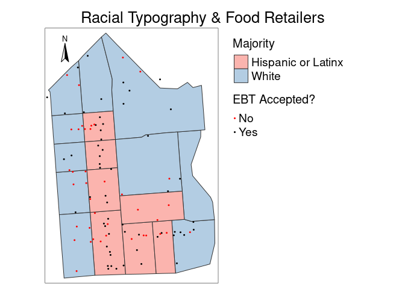
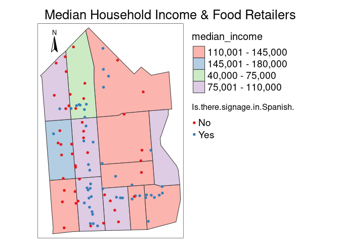
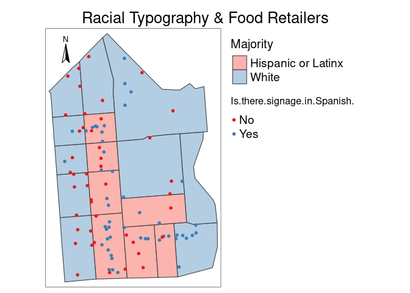

Final Project: The Socioeconomic and Food Reatil Landscape of San
Francisco’s Mission District
================

By: Fischer Heimburger (@fheimburger97) & Caroline Mahdavi (@cmahdavi)

# Introduction

The Mission District (known as “This Mission”) in San Francisco known
for it’s widening economic inequity, relatively high ethnic
diversity–including being a local hub for Latinx culture and heritage,
and vibrant food scene. This research seeks to first cultivate an
understanding of the socio-economic landscape of the Mission District,
and then initiate research on how this landscape is reflected in the
distribution of food retailers.

Economic inequity is a major challenge facing the Mission District
today. In 2020, it was found that “the highest and lowest income
brackets compose almost 40% of all Mission households” ([Mission Action
Plan
2020](https://default.sfplanning.org/Citywide/Mission2020/MAP2020_Status_Report_2018.pdf).
This demonstrates the increasing income gap experienced in the Mission
District. In addition, the economic landscape of the Mission District is
highly influenced by gentrification–the process by which the migration
of high-income residents to a place displaces low-income, often
marginalized, residents ([Chapple and Thomas
2021](https://www.urbandisplacement.org/about/what-are-gentrification-and-displacement/)).
San Francisco was recently found to be the most intensely gentrified
city in America ([Richardson, Mitchell, and Edlebi
2020](https://ncrc.org/gentrification20/)) and the Mission District, one
of the neighborhoods with the most advanced levels of gentrification
([Chapple and Thomas
2021](https://www.urbandisplacement.org/about/what-are-gentrification-and-displacement/)).
We hope to understand this unique and stark economic landscape by
mapping out median household incomes by census tract within the Mission
District. Our research on this is influenced by data and figures from
the [Urban Displacement Project](https://www.urbandisplacement.org/).
The Urban Displacement Project traces gentrification throughout the San
Francisco Bay Area. As a part of their studies, they gather data on
median income levels within the Mission District and map out their
findings. We hope, in part, to recreate aspects of their figures with
updated census data.

While much of the Bay Area is growing more racially segregated
([Menendian, Gambhir and Gailes
2021](https://belonging.berkeley.edu/roots-structural-racism)), The
Mission is unique for its relatively high ethnic diversity ([Hom
2021](https://missionlocal.org/2021/07/the-mission-isnt-as-racially-segregated-as-the-bay-does-that-point-to-gentrification)).
While overall in 2019 the Mission District was 38.7% Latinx, 36.4%
White, and 13.7% Asian ([City Data
2021](https://www.city-data.com/neighborhood/Mission-District-San-Francisco-CA.html));
the demographic makeup of race varies depending on locale ([Hom
2021](https://missionlocal.org/2021/07/the-mission-isnt-as-racially-segregated-as-the-bay-does-that-point-to-gentrification)).
Additionally, recent years have shown dynamic shifts in demographics as
the 2020 Census revealed a 14.4% decline in Latinx residents within the
Mission District and a 34.8% increase in Asian residents ([Horowitz and
Jarret
2021](https://missionlocal.org/2021/09/census-2020-as-san-francisco-grew-the-ethnic-makeup-of-its-neighborhoods-changed-heres-how)).
The [Othering & Belonging
Institute](https://belonging.gis-cdn.net/us_segregation_map/?year=2020)
researches levels of segregation in the San Francisco Bay Area. As part
of their research, they have created maps of the Mission District that
display levels of segregation and racial diversity. We seek to create
similar maps that display racial majorities by census tract to further
understand the demographic landscape of The Mission. We then hope to
understand how these socio-economic landscapes interact the landscape of
food retailers in the Mission District.

Food systems are complex, interconnected bio-physical and socio-economic
webs that are influenced by environmental, social, political, and
economic systems, institutions, and actors ([Ericksen
2008](https://doi.org/10.1016/j.gloenvcha.2007.09.002)). For many living
in cities, like those within the Mission District, relationships with
food systems revolve around food retailers—including supermarkets,
grocery stores, corner markets, and convenience stores—that help connect
food producers with food consumers ([Trivette
2019](https://link.springer.com/article/10.1007/s10460-018-9885-1)).
Using data from the [City of San
Francisco](https://datasf.org/opendata/), we hope to map out the current
distribution of food retailers in the Mission District. Then we seek to
understand how this distribution may be interconnected with class and
race.

Our research is organized as follows. First, we map out income levels by
census tract in the Mission District. Second, we map out racial
majorities by census tract in The Mission. We then create a demographic
table that organizes the socio-economic landscape of the district. In
the fourth section we map out the distribution of food retailers within
the Mission District. Lastly, we overlay the socio-economic maps with
the food retailer map.

#### Data note: We used the following libraries to analyze our data. Additionally, please run `install.packages("tidycensus")` in the console window.

Google API Key – need to upload key
\#`{r} register_google(key = "", write = TRUE) #`

``` r
retail_data <- read_csv("Food Retail Final List (Edit 3_30).csv") %>%
  select(!"Timestamp")
```

    ## New names:
    ## * `` -> ...47

    ## Rows: 97 Columns: 50
    ## ── Column specification ────────────────────────────────────────────────────────
    ## Delimiter: ","
    ## chr (35): Timestamp, Name of Food Retailer, Address, Date Assessed, Type of ...
    ## dbl (13): Median Price of a Dozen Eggs, Median Price of a Loaf of Bread, Mil...
    ## lgl  (1): ...47
    ## 
    ## ℹ Use `spec()` to retrieve the full column specification for this data.
    ## ℹ Specify the column types or set `show_col_types = FALSE` to quiet this message.

``` r
retail_data$coord <- paste(retail_data$lon, retail_data$lat) 
retail_data
```

    ## # A tibble: 97 × 50
    ##    `Name of Food Reta…` Address `Date Assessed` `Type of Store` `What type of …`
    ##    <chr>                <chr>   <chr>           <chr>           <chr>           
    ##  1 Mission Foodhall     3100 1… 1/26/2022       Specialty Food… Foodhall        
    ##  2 Fred’s Liquors & De… 200 Va… 1/26/2022       Grocery Store   <NA>            
    ##  3 E And M Market       399 Va… 1/26/2022       Convenience St… <NA>            
    ##  4 K & H Liquor         501 Va… 1/26/2022       Convenience St… <NA>            
    ##  5 Valencia Whole Foods 999 Va… 1/26/2022       Grocery Store   <NA>            
    ##  6 Decamere Market      1001 V… 1/26/2022       Convenience St… <NA>            
    ##  7 Indian Spices and G… 3265 2… 1/26/2022       Specialty Food… Ethnic Store    
    ##  8 Valencia Farmer’s M… 1299 V… 1/26/2022       Grocery Store   <NA>            
    ##  9 Valencia Grocery     1300 V… 1/26/2022       Convenience St… <NA>            
    ## 10 Mr. Liquor           1200 V… 1/26/2022       Convenience St… <NA>            
    ## # … with 87 more rows, and 45 more variables: `EBT Accepted?` <chr>,
    ## #   `Number of Locations (chain?)` <dbl>, `Median Price of a Dozen Eggs` <dbl>,
    ## #   `Median Price of a Loaf of Bread` <dbl>,
    ## #   `Median Price of a Gallon of Milk` <chr>, `Milk Standardized_Gallon` <dbl>,
    ## #   `Median Price of Oranges` <chr>, `Orange Standardized_lbs` <dbl>,
    ## #   `Median Price of Organic Oranges` <chr>,
    ## #   `Organic Oranges Standardized_lbs` <dbl>, …

## I Tract Income Typology

#### Table 1.1: Downloading San Francisco’s Geopackage

First, we downloaded the [geopackage for San
Francisco](https://github.com/urban-displacement/displacement-typologies/tree/main/data/downloads_for_public).
In the following chunk, we load the geopackage using `read_sf` and
`filter` for census tracts in the Mission District. We `select` to show
“GEOID” and “geom” which will help create our map.

``` r
gfile <- read_sf("sanfrancisco.gpkg") %>%
  select(GEOID, geom) %>%
  filter(GEOID == "6075020200" | GEOID == "6075020100" | GEOID == "6075020800" | GEOID == "6075020700" | GEOID == "6075022902" | GEOID == "6075020900" | GEOID == "6075017700" | GEOID == "6075022901" | GEOID == "6075022803" | GEOID == "6075022903" | GEOID == "6075022801" | GEOID == "6075021000" | GEOID == "6075022802")
```

#### Table 1.2: Downloading San Francisco’s Demographics

We then use `read.csv` to load typology data from the [Urban
Displacement Project
github](https://github.com/urban-displacement/displacement-typologies/tree/main/data/outputs/typologies).
The definitions for variable names can be found
[here](https://github.com/urban-displacement/displacement-typologies/blob/main/data/outputs/typologies/typologies_codebook.md).

``` r
demographics <- read.csv("https://raw.githubusercontent.com/urban-displacement/displacement-typologies/main/data/outputs/typologies/SanFrancisco_typology_output.csv")
```

#### Table 1.3: Median Household Income Table

First, we create the **medianincome** table which shows “GEOID” and
“hinc_18”; “hinc_18” is the median household income in the past 12
months (in 2018 inflation-adjusted dollars) in 2018. Second, with
`left_join`, we join the newly created **medianincome** table and the
initial **gfile** table to create our **incomejoin** table.

``` r
medianincome <- demographics %>%
  select(GEOID, hinc_18) %>%
  rename("Income in Dollars" = hinc_18)
incomejoin <-left_join(gfile, medianincome, by = "GEOID")
incomejoin
```

    ## # A tibble: 13 × 3
    ##         GEOID                                              geom `Income in Dol…`
    ##         <dbl>                                <MULTIPOLYGON [°]>            <dbl>
    ##  1 6075020800 (((-122.4217 37.7633, -122.4173 37.76357, -122.4…           103134
    ##  2 6075017700 (((-122.4187 37.77564, -122.4156 37.7731, -122.4…           114722
    ##  3 6075020700 (((-122.4261 37.76304, -122.4217 37.7633, -122.4…           167422
    ##  4 6075020100 (((-122.4226 37.7725, -122.4222 37.77291, -122.4…            46750
    ##  5 6075022801 (((-122.4173 37.76357, -122.4136 37.76382, -122.…           117368
    ##  6 6075022803 (((-122.4167 37.75717, -122.4078 37.75771, -122.…           123000
    ##  7 6075022903 (((-122.4093 37.7544, -122.4074 37.75451, -122.4…           128750
    ##  8 6075021000 (((-122.4254 37.75503, -122.421 37.75529, -122.4…           138523
    ##  9 6075022901 (((-122.4164 37.75397, -122.412 37.75423, -122.4…            91464
    ## 10 6075020200 (((-122.4269 37.76917, -122.4264 37.7696, -122.4…           100099
    ## 11 6075022802 (((-122.4084 37.76443, -122.4051 37.76463, -122.…           102750
    ## 12 6075020900 (((-122.421 37.75529, -122.4187 37.75544, -122.4…           106875
    ## 13 6075022902 (((-122.412 37.75423, -122.4093 37.7544, -122.40…           133239

``` r
medianincome_test <- demographics %>%
  select(GEOID, hinc_18) %>%
  mutate(median_income = case_when(
    hinc_18 <= 75000 ~ "40,000 - 75,000",
    hinc_18 >= 75001 & hinc_18 <= 110000 ~ "75,001 - 110,000",
    hinc_18 >= 110001 & hinc_18 <= 145000 ~ "110,001 - 145,000",
    hinc_18 >= 145001 ~ "145,001 - 180,000")) %>%
  rename("Income in Dollars" = hinc_18)
  #rename("Median Income" = median_income)
incomejoin_test <-left_join(gfile, medianincome_test, by = "GEOID")
incomejoin_test
```

    ## # A tibble: 13 × 4
    ##         GEOID                                geom `Income in Dol…` median_income
    ##         <dbl>                  <MULTIPOLYGON [°]>            <dbl> <chr>        
    ##  1 6075020800 (((-122.4217 37.7633, -122.4173 37…           103134 75,001 - 110…
    ##  2 6075017700 (((-122.4187 37.77564, -122.4156 3…           114722 110,001 - 14…
    ##  3 6075020700 (((-122.4261 37.76304, -122.4217 3…           167422 145,001 - 18…
    ##  4 6075020100 (((-122.4226 37.7725, -122.4222 37…            46750 40,000 - 75,…
    ##  5 6075022801 (((-122.4173 37.76357, -122.4136 3…           117368 110,001 - 14…
    ##  6 6075022803 (((-122.4167 37.75717, -122.4078 3…           123000 110,001 - 14…
    ##  7 6075022903 (((-122.4093 37.7544, -122.4074 37…           128750 110,001 - 14…
    ##  8 6075021000 (((-122.4254 37.75503, -122.421 37…           138523 110,001 - 14…
    ##  9 6075022901 (((-122.4164 37.75397, -122.412 37…            91464 75,001 - 110…
    ## 10 6075020200 (((-122.4269 37.76917, -122.4264 3…           100099 75,001 - 110…
    ## 11 6075022802 (((-122.4084 37.76443, -122.4051 3…           102750 75,001 - 110…
    ## 12 6075020900 (((-122.421 37.75529, -122.4187 37…           106875 75,001 - 110…
    ## 13 6075022902 (((-122.412 37.75423, -122.4093 37…           133239 110,001 - 14…

#### Figure 1.1: Mapping Median Household Income in the Mission District

Using **tmap** and our **incomejoin** table, we then create a map
showing median household income across census tracts in the Mission
District.

``` r
incomemap_2 <- tm_shape(incomejoin_test) +
             tm_style("watercolor") +
             tm_polygons("median_income") +
             tm_layout(main.title="Median Household Income",
                       main.title.position = "centre",
                       main.title.size = 1.6) +
             tm_legend(position = c("right", "top"),
             legend.outside = TRUE,
             legend.outside.size = .35,
             legend.title.size = 1.5,
             legend.text.size = 1.2) +
  tm_compass(position = c("left", "top"))
incomemap_2
```

<!-- -->

## II Tract Racial Typology

To work with census data, we install **tidycensus** from CRAN with the
following command: `install.packages("tidycensus")`. After loading the
**tidycensus** and **tidyverse** libraries, obtain a [Census API
key](http://api.census.gov/data/key_signup.html). Note: 2020 decennial
Census data use differential privacy, a technique that introduces errors
into data to preserve respondent confidentiality, small counts should be
interpreted with caution.

``` r
census_api_key("77bb8e57772d9321db5adcd03b9bf2c3bce563c3", install = TRUE, overwrite = TRUE)
```

    ## [1] "77bb8e57772d9321db5adcd03b9bf2c3bce563c3"

#### Table 2.1 Population Numbers by Race

Using **tidycensus**, we will get the values for four variables: total
population, White population, Asian population, and Hispanic or Latino
population. The argument to the `geography` parameter is “tract”, and by
by specifying `state`, `county`, and `year` we get the desired
population numbers for each census tract in San Francisco from 2020.
Note that `geometry` is set to true in the first table to help create
maps later.

``` r
#White Population
white <- get_decennial(geography = "tract",
                      state = "CA",
                      county = "San Francisco",
                      year = 2020,
                      variables = c(white = "P1_003N"))
#Asian Population
asian <- get_decennial(geography = "tract",
                      state = "CA",
                      county = "San Francisco",
                      year = 2020,
                      variables = c(asian = "P1_006N"))
#Hispanic or Latino Population
latinx <- get_decennial(geography = "tract",
                      state = "CA",
                      county = "San Francisco",
                      year = 2020,
                      variables = c(latinx = "P2_002N"))
#Total Population
totalpop <- get_decennial(geography = "tract",
                      state = "CA",
                      county = "San Francisco",
                      year = 2020,
                      variables = c(totalpop = "P1_002N"),
                      geometry = TRUE)
```

    ##   |                                                                              |                                                                      |   0%  |                                                                              |                                                                      |   1%  |                                                                              |=                                                                     |   1%  |                                                                              |=                                                                     |   2%  |                                                                              |==                                                                    |   2%  |                                                                              |==                                                                    |   3%  |                                                                              |===                                                                   |   4%  |                                                                              |===                                                                   |   5%  |                                                                              |====                                                                  |   5%  |                                                                              |====                                                                  |   6%  |                                                                              |=====                                                                 |   6%  |                                                                              |=====                                                                 |   7%  |                                                                              |=====                                                                 |   8%  |                                                                              |======                                                                |   8%  |                                                                              |======                                                                |   9%  |                                                                              |=======                                                               |   9%  |                                                                              |=======                                                               |  10%  |                                                                              |=======                                                               |  11%  |                                                                              |========                                                              |  11%  |                                                                              |========                                                              |  12%  |                                                                              |=========                                                             |  13%  |                                                                              |==========                                                            |  14%  |                                                                              |==========                                                            |  15%  |                                                                              |===========                                                           |  16%  |                                                                              |============                                                          |  17%  |                                                                              |=============                                                         |  18%  |                                                                              |=============                                                         |  19%  |                                                                              |==============                                                        |  19%  |                                                                              |===============                                                       |  21%  |                                                                              |================                                                      |  23%  |                                                                              |==================                                                    |  25%  |                                                                              |===================                                                   |  27%  |                                                                              |====================                                                  |  28%  |                                                                              |=====================                                                 |  30%  |                                                                              |======================                                                |  31%  |                                                                              |========================                                              |  34%  |                                                                              |=========================                                             |  35%  |                                                                              |==========================                                            |  37%  |                                                                              |===========================                                           |  39%  |                                                                              |============================                                          |  40%  |                                                                              |=============================                                         |  42%  |                                                                              |==============================                                        |  43%  |                                                                              |===============================                                       |  45%  |                                                                              |================================                                      |  45%  |                                                                              |================================                                      |  46%  |                                                                              |=================================                                     |  48%  |                                                                              |====================================                                  |  51%  |                                                                              |=====================================                                 |  52%  |                                                                              |======================================                                |  54%  |                                                                              |=======================================                               |  55%  |                                                                              |=================================================                     |  71%  |                                                                              |==================================================                    |  71%  |                                                                              |====================================================                  |  75%  |                                                                              |=====================================================                 |  75%  |                                                                              |======================================================================| 100%

#### Table 2.2: Race Percents

Next, with a series of `left_join`, we join the four previous tables by
“GEOID”. We `rename` and `select` several important variables for
neatness and clarity. We use `mutate` to add three columns displaying
the percentage of the total population that each race is.

``` r
totalandwhite <- left_join(totalpop, white, by = "GEOID") %>%
    rename(tract = NAME.x,
           totalvar = variable.x,
           totalval = value.x,
           whitevar = variable.y,
           whiteval = value.y) %>%
  select(GEOID, tract, totalvar, totalval, whitevar, whiteval)
asianandlatinx <- left_join(asian, latinx, by = "GEOID") %>%
    rename(tract = NAME.x,
           asianvar = variable.x,
           asianval = value.x,
           latinxvar = variable.y,
           latinxval = value.y) %>%
  select(GEOID, asianvar, asianval, latinxvar, latinxval)
ethnic_table <- left_join(totalandwhite, asianandlatinx, by = "GEOID") %>%
  mutate(percwhite = (whiteval/totalval)*100) %>%
  mutate(percasian = (asianval/totalval)*100) %>%
  mutate(perclatinx = (latinxval/totalval)*100)
ethnic_table
```

    ## # A tibble: 244 × 14
    ##    GEOID     tract totalvar totalval whitevar whiteval                  geometry
    ##    <chr>     <chr> <chr>       <dbl> <chr>       <dbl>        <MULTIPOLYGON [°]>
    ##  1 06075035… Cens… totalpop     3888 white        1957 (((-122.5099 37.76409, -…
    ##  2 06075040… Cens… totalpop     3936 white        2354 (((-122.4648 37.78856, -…
    ##  3 06075047… Cens… totalpop     3527 white        1582 (((-122.4887 37.77611, -…
    ##  4 06075026… Cens… totalpop     3852 white         260 (((-122.4113 37.71061, -…
    ##  5 06075012… Cens… totalpop     3088 white        1566 (((-122.4154 37.78932, -…
    ##  6 06075020… Cens… totalpop     3247 white        2238 (((-122.4352 37.76273, -…
    ##  7 06075021… Cens… totalpop     2620 white        2106 (((-122.4428 37.75238, -…
    ##  8 06075026… Cens… totalpop     2902 white         818 (((-122.4318 37.72825, -…
    ##  9 06075025… Cens… totalpop     4182 white         551 (((-122.4105 37.72849, -…
    ## 10 06075032… Cens… totalpop     3979 white        1553 (((-122.4848 37.76516, -…
    ## # … with 234 more rows, and 7 more variables: asianvar <chr>, asianval <dbl>,
    ## #   latinxvar <chr>, latinxval <dbl>, percwhite <dbl>, percasian <dbl>,
    ## #   perclatinx <dbl>

#### Table 2.3: Race Percents and Majorities

Next, we `mutate` to add a “majority” column. In this column, we use
`case_when` to show which of the three races has the highest percent of
the population, and thus, is the majority of its tract.

``` r
percents <- ethnic_table  %>% 
  mutate(Majority = case_when(
    perclatinx > percasian & perclatinx > percwhite ~ "Hispanic or Latinx",
    percwhite > percasian & percwhite > perclatinx ~ "White",
    percasian > percwhite & percasian > perclatinx ~ "Asian")) %>%
  select(GEOID, tract, percwhite, percasian, perclatinx, Majority, geometry)
```

#### Table 2.4: Specifying the Boundaries

To narrow our scope, we then `filter` to only include census tracts in
the Mission District of San Francisco.

``` r
mission_geo_zero <- percents %>% pull(GEOID)
mission_percents_clean <- percents %>%
  mutate(GEOID = substring(mission_geo_zero, 2)) %>%
  filter(GEOID == "6075020201" | GEOID == "6075020202" | GEOID == "6075020101" | GEOID == "6075020102" | GEOID == "6075020801" | GEOID == "6075020802" | GEOID == "6075020701" | GEOID == "6075020702" | GEOID == "6075022902" | GEOID == "6075020900" | GEOID == "6075017700" | GEOID == "6075022901" | GEOID == "6075022803" | GEOID == "6075022903" | GEOID == "6075022801" | GEOID == "6075021000" | GEOID == "6075022802")
mission_percents_clean
```

    ## # A tibble: 17 × 7
    ##    GEOID tract percwhite percasian perclatinx Majority                  geometry
    ##    <chr> <chr>     <dbl>     <dbl>      <dbl> <chr>           <MULTIPOLYGON [°]>
    ##  1 6075… Cens…      41.7      25.2       35.5 White    (((-122.4226 37.7725, -1…
    ##  2 6075… Cens…      35.6      20.9       45.2 Hispani… (((-122.422 37.76654, -1…
    ##  3 6075… Cens…      72.8      14.3       18.0 White    (((-122.4258 37.75984, -…
    ##  4 6075… Cens…      44.4      17.8       49.4 Hispani… (((-122.421 37.75529, -1…
    ##  5 6075… Cens…      37.7      11.6       61.6 Hispani… (((-122.4164 37.75397, -…
    ##  6 6075… Cens…      38.0      18.8       54.5 Hispani… (((-122.4217 37.7633, -1…
    ##  7 6075… Cens…      51.9      24.1       29.9 White    (((-122.4265 37.76627, -…
    ##  8 6075… Cens…      48.8      17.1       47.8 White    (((-122.4093 37.7544, -1…
    ##  9 6075… Cens…      47.6      26.0       32.8 White    (((-122.4084 37.76443, -…
    ## 10 6075… Cens…      66.5      20.9       20.1 White    (((-122.4261 37.76304, -…
    ## 11 6075… Cens…      68.2      17.5       21.8 White    (((-122.4254 37.75503, -…
    ## 12 6075… Cens…      45.0      16.2       53.4 Hispani… (((-122.412 37.75423, -1…
    ## 13 6075… Cens…      44.9      19.6       46.9 Hispani… (((-122.4214 37.7601, -1…
    ## 14 6075… Cens…      46.2      23.2       30.2 White    (((-122.4187 37.77564, -…
    ## 15 6075… Cens…      48.3      17.3       41.6 White    (((-122.4173 37.76357, -…
    ## 16 6075… Cens…      52.7      26.1       25.8 White    (((-122.4269 37.76917, -…
    ## 17 6075… Cens…      46.5      15.4       51.5 Hispani… (((-122.4167 37.75717, -…

#### Figure 2.1: Mapping Racial Majorities in the Mission District

-   

``` r
ethnic_map <-
  tm_shape(mission_percents_clean) +
  tm_polygons("Majority") +
  tm_style("watercolor") +
  tm_layout(main.title = "Racial Typography",
            main.title.position = "centre",
            main.title.size = 1.6) +
  tm_legend(position = c("right", "top"),
            legend.outside = TRUE,
            legend.outside.size = .35,
            legend.title.size = 1.5,
            legend.text.size = 1.2) +
  tm_compass(position = c("left", "top"))
ethnic_map
```

<!-- -->

## III Demographics Table

#### Table 3.1

``` r
incomejoin_chr <- incomejoin %>%
  mutate_at("GEOID", as.character)
incomejoin_chr
```

    ## # A tibble: 13 × 3
    ##    GEOID                                                   geom `Income in Dol…`
    ##    <chr>                                     <MULTIPOLYGON [°]>            <dbl>
    ##  1 6075020800 (((-122.4217 37.7633, -122.4173 37.76357, -122.4…           103134
    ##  2 6075017700 (((-122.4187 37.77564, -122.4156 37.7731, -122.4…           114722
    ##  3 6075020700 (((-122.4261 37.76304, -122.4217 37.7633, -122.4…           167422
    ##  4 6075020100 (((-122.4226 37.7725, -122.4222 37.77291, -122.4…            46750
    ##  5 6075022801 (((-122.4173 37.76357, -122.4136 37.76382, -122.…           117368
    ##  6 6075022803 (((-122.4167 37.75717, -122.4078 37.75771, -122.…           123000
    ##  7 6075022903 (((-122.4093 37.7544, -122.4074 37.75451, -122.4…           128750
    ##  8 6075021000 (((-122.4254 37.75503, -122.421 37.75529, -122.4…           138523
    ##  9 6075022901 (((-122.4164 37.75397, -122.412 37.75423, -122.4…            91464
    ## 10 6075020200 (((-122.4269 37.76917, -122.4264 37.7696, -122.4…           100099
    ## 11 6075022802 (((-122.4084 37.76443, -122.4051 37.76463, -122.…           102750
    ## 12 6075020900 (((-122.421 37.75529, -122.4187 37.75544, -122.4…           106875
    ## 13 6075022902 (((-122.412 37.75423, -122.4093 37.7544, -122.40…           133239

#### Table 3.2: Demographics Table

``` r
finaljoin <- right_join(st_drop_geometry(incomejoin_chr), st_drop_geometry(mission_percents_clean), by = "GEOID") %>% 
  select(GEOID, tract, "Income in Dollars", Majority, percwhite, perclatinx, percasian) %>% 
  rename("Median Income ($)" = "Income in Dollars", Tract = tract, "White Percentage" = percwhite, "Hispanic/Latinx Percentage" = perclatinx, "Asian Percentage" = percasian, "Racial Majority" = Majority)
finaljoin
```

    ## # A tibble: 17 × 7
    ##    GEOID      Tract           `Median Income…` `Racial Majori…` `White Percent…`
    ##    <chr>      <chr>                      <dbl> <chr>                       <dbl>
    ##  1 6075017700 Census Tract 1…           114722 White                        46.2
    ##  2 6075022801 Census Tract 2…           117368 White                        48.3
    ##  3 6075022803 Census Tract 2…           123000 Hispanic or Lat…             46.5
    ##  4 6075022903 Census Tract 2…           128750 White                        48.8
    ##  5 6075021000 Census Tract 2…           138523 White                        68.2
    ##  6 6075022901 Census Tract 2…            91464 Hispanic or Lat…             37.7
    ##  7 6075022802 Census Tract 2…           102750 White                        47.6
    ##  8 6075020900 Census Tract 2…           106875 Hispanic or Lat…             44.4
    ##  9 6075022902 Census Tract 2…           133239 Hispanic or Lat…             45.0
    ## 10 6075020101 Census Tract 2…               NA White                        41.7
    ## 11 6075020102 Census Tract 2…               NA Hispanic or Lat…             35.6
    ## 12 6075020701 Census Tract 2…               NA White                        72.8
    ## 13 6075020802 Census Tract 2…               NA Hispanic or Lat…             38.0
    ## 14 6075020201 Census Tract 2…               NA White                        51.9
    ## 15 6075020702 Census Tract 2…               NA White                        66.5
    ## 16 6075020801 Census Tract 2…               NA Hispanic or Lat…             44.9
    ## 17 6075020202 Census Tract 2…               NA White                        52.7
    ## # … with 2 more variables: `Hispanic/Latinx Percentage` <dbl>,
    ## #   `Asian Percentage` <dbl>

## IV Food Retailers

#### Table 4.1: Uploading business data from data.sfgov.org.

``` r
#SF_businesses <- read_csv("https://data.sfgov.org/api/views/g8m3-pdis/rows.csv?accessType=DOWNLOAD")
#SF_businesses
```

#### Table 4.2: Business in the Mission with LIC Code H in it. LIC codes with H’s are retail businesses, this was a crucial filtering step to finding food retailers.

``` r
#Mission_H_Codes <- SF_businesses %>%
   #filter(str_detect(`LIC Code`, "H"), `Neighborhoods - Analysis Boundaries` == "Mission") %>%
  #select(`Ownership Name`, `DBA Name`, `Street Address`, `Business Start Date`, `Business End Date`, `Mail State`, `NAICS Code`, `NAICS Code Description`, `LIC Code`, `LIC Code Description`, `Neighborhoods - Analysis Boundaries`)
#Mission_H_Codes %>% select(`Ownership Name`, `DBA Name`, `LIC Code`, `LIC Code Description`)
```

#### List 4.1: The following is a list of LIC codes that are food retailers. This list includes grocery stores, corner markets, convienence stores, supermarkets, bakeries, and drug stores. This list does not include restaurants.

``` r
#H_strings <- c("H01", "H02", "H03", "H04", "H05", "H06", "H07", "H08", "H09", "H10", "H11", "H12", "H13", "H14", "H16", "H19", "H80", "H81", "H83", "H88", "H89", "H92")
```

#### Table 4.3: The follow is a table that includes data on all food retailers within the Mission District.

``` r
#Final_Mission_Food_Retailers <- SF_businesses %>%
  #filter(`Neighborhoods - Analysis Boundaries` == "Mission") %>%
  #filter(str_detect(`LIC Code`, paste(H_strings, collapse = "|")))
#Final_Mission_Food_Retailers
```

``` r
#Clean_Final_Retail <- Final_Mission_Food_Retailers %>%
  #select("Ownership Name", "DBA Name", "Street Address", "LIC Code Description")
#Clean_Final_Retail
```

``` r
#Clean_Order_r <- Clean_Final_Retail[order(Clean_Final_Retail$"DBA Name"),]
#Clean_Order_r
```

``` r
#write.csv(Clean_Order_r, "C:\\Users\\fheim\\Desktop\\Test\\People.csv", row.names = FALSE)
```

#### List 4.2: The following are the coordinates for each food retail store in the Mission District.

``` r
#coordinates <- Final_Mission_Food_Retailers %>% pull("Business Location")
#coordinates
```

#### Figure 4.1: The follow is a map of all food retailers within the Mission District. Each dot represents a food retailer. While this map does not include streets or the outline of the Mission Distict, maps in the following section will include an outline of the Mission District along with demographic information.

-   

``` r
#geo_final <- Final_Mission_Food_Retailers %>%
 # rename(geometry = `Business Location`) %>%
  #mutate(geometry = as.list(geometry)) %>%
#tm_shape(geo_final) + tm_dots()
```

``` r
retail_data <- read_csv("Food Retail Final List (Edit 3_30).csv")
```

    ## New names:
    ## * `` -> ...47

    ## Rows: 97 Columns: 50
    ## ── Column specification ────────────────────────────────────────────────────────
    ## Delimiter: ","
    ## chr (35): Timestamp, Name of Food Retailer, Address, Date Assessed, Type of ...
    ## dbl (13): Median Price of a Dozen Eggs, Median Price of a Loaf of Bread, Mil...
    ## lgl  (1): ...47
    ## 
    ## ℹ Use `spec()` to retrieve the full column specification for this data.
    ## ℹ Specify the column types or set `show_col_types = FALSE` to quiet this message.

``` r
retail_data$coord <- paste(retail_data$lon, retail_data$lat)
retail_data
```

    ## # A tibble: 97 × 51
    ##    Timestamp       `Name of Food Retai…` Address `Date Assessed` `Type of Store`
    ##    <chr>           <chr>                 <chr>   <chr>           <chr>          
    ##  1 1/27/2022 12:38 Mission Foodhall      3100 1… 1/26/2022       Specialty Food…
    ##  2 1/27/2022 12:41 Fred’s Liquors & Del… 200 Va… 1/26/2022       Grocery Store  
    ##  3 1/27/2022 12:43 E And M Market        399 Va… 1/26/2022       Convenience St…
    ##  4 1/27/2022 12:46 K & H Liquor          501 Va… 1/26/2022       Convenience St…
    ##  5 1/27/2022 12:48 Valencia Whole Foods  999 Va… 1/26/2022       Grocery Store  
    ##  6 1/27/2022 12:50 Decamere Market       1001 V… 1/26/2022       Convenience St…
    ##  7 1/27/2022 12:52 Indian Spices and Gr… 3265 2… 1/26/2022       Specialty Food…
    ##  8 1/27/2022 12:55 Valencia Farmer’s Ma… 1299 V… 1/26/2022       Grocery Store  
    ##  9 1/27/2022 12:59 Valencia Grocery      1300 V… 1/26/2022       Convenience St…
    ## 10 1/27/2022 13:02 Mr. Liquor            1200 V… 1/26/2022       Convenience St…
    ## # … with 87 more rows, and 46 more variables:
    ## #   `What type of Specialty Food Store?` <chr>, `EBT Accepted?` <chr>,
    ## #   `Number of Locations (chain?)` <dbl>, `Median Price of a Dozen Eggs` <dbl>,
    ## #   `Median Price of a Loaf of Bread` <dbl>,
    ## #   `Median Price of a Gallon of Milk` <chr>, `Milk Standardized_Gallon` <dbl>,
    ## #   `Median Price of Oranges` <chr>, `Orange Standardized_lbs` <dbl>,
    ## #   `Median Price of Organic Oranges` <chr>, …

``` r
retail_map <- retail_data %>%
 st_as_sf(coords = c('lon', 'lat'), crs = "WGS84")
tm_shape(retail_map) + tm_dots()
```

<!-- -->

## V Final Maps

#### Figure 5.1: Food Retailers and Median Household Income in the Mission District

``` r
dots <- tm_shape(retail_map) + tm_dots(col="black") + tm_add_legend(shape = "tm_dots", labels = ('Food Retailers'), col = "black")
incomemap_with_food_retailers <- tm_shape(incomejoin_test) +
             tm_style("watercolor") +
             tm_polygons("median_income") +
             tm_layout(main.title="Median Household Income & Food Retailers",
                       main.title.position = "centre",
                       main.title.size = 1.6) +
             tm_legend(position = c("right", "top"),
             legend.outside = TRUE,
             legend.outside.size = .35,
             legend.title.size = 1.5,
             legend.text.size = 1.2) +
  tm_compass(position = c("left", "top"))
income_map_with_retail <- incomemap_with_food_retailers + dots
income_map_with_retail
```

<!-- -->

#### Figure 5.2: Food Retailers and Racial Majorities in the Mission District

-   

``` r
dots <- tm_shape(retail_map) + tm_dots(col="black") + tm_add_legend(shape = "tm_dots", labels = ('Food Retailers'), col = "black")
ethnicity_map_with_food_retailers <-
  tm_shape(mission_percents_clean) +
  tm_polygons("Majority") +
  tm_style("watercolor") +
  tm_layout(main.title = "Racial Typography & Food Retailers",
            main.title.position = "centre",
            main.title.size = 1.6) +
  tm_legend(position = c("right", "top"),
            legend.outside = TRUE,
            legend.outside.size = .35,
            legend.title.size = 1.5,
            legend.text.size = 1.2) +
  tm_compass(position = c("left", "top"))
ethnicity_with_retail <- ethnicity_map_with_food_retailers + dots
ethnicity_with_retail
```

<!-- -->

# Conclusion

We were able to create maps of the Mission District based off median
household income, racial majorities, and the distribution of food
retailers. First, our map displaying median household income
demonstrates the income gap experienced in the Mission today. Median
income in tracts ranged from 40,000-60,000 USD on the lower end, to
160,000-180,000 USD on the upper end, with five other ranges in between.
The lowest and highest median income tracts share a corner in the
Northwestern quadrant of the Mission, demonstrating the proximity of the
income gap in the Mission District.

Our racial typography map revealed that Hispanic or Latinx and White are
the majority races in the Mission District. There are ten tracts that
were predominantly white and seven tracts that are predominantly
Hispanic or Latinx. These findings demonstrate that a degree of racial
diversity exists in the Mission District, albeit largely between two
races. If you compare the Median Household Income map with the Racial
Typography map it is apparent that there is some degree of correlation
between lower-income census tracts and tracts that are predominately
Hispanic/Latinx. This may be an important trend when researching levels
of gentrification within the Mission District. However, while our
findings display that there is a degree of racial integration within the
Mission District, they do not reveal the degree of segregation occurring
within each tact. Further research would be needed to understand the
landscape of segregation within each tract.

When we examined the socio-economic landscape of the Mission District in
relation to the distribution of food retailers, we observed that there
seems to be a level of correlation between the number of food retailers
and tracts that are predominantly Hispanic and Latinx. If the maps we
generated are compared to street maps (we direct readers to use Google
Maps or other mapping software), the majority of food retailers are
located along Mission Street and 24th Street–both streets are hubs for
Latinx populations and culture. Our Racial Typography & Food Retailers
map exemplifies that there may be a correlation between the location and
quantity of food retailers in the Mission District and racial majority;
however, our Median Household Income & Food Retailers map doesn’t
demonstrate the same level of correlation. In the later case, the
location of food retailers may have more to do with business corridors
than median household income distribution.

In conclusion, we were able to replicate multiple maps used in
researching the socio-economic landscapes of the Mission District. We
were then able to start research, and open a discussion, about how this
correlates with the distribution of food retailers within the district.
Our work should be scene as a catalyst for future research on the food
retail landscape of the Mission District. For example, it should be
stated that in our maps all food retailers–regardless of size, stock, or
purpose–are resembled by a single black dot. However, there is great
diversity among food retailers. Some may be supermarkets, convenience
stores, or corner markets. Additionally, some may cater to the general
public, while others may sell specialty or ethnic foods. These kinds of
differences would be important to know before drawing any conclusions
regarding the distribution of food retailers in the Mission District in
relation to socio-economic landscapes. Using our research as a launching
pad, it is our hope that researches take our findings and code to
further examine the role of food retailers in the socio-economic fabric
of the Mission District.

\#Research Data (DRAFT)

``` r
retail_data <- read_csv("Food Retail Final List (Edit 3_30).csv") %>%
  select(!"Timestamp")
```

    ## New names:
    ## * `` -> ...47

    ## Rows: 97 Columns: 50
    ## ── Column specification ────────────────────────────────────────────────────────
    ## Delimiter: ","
    ## chr (35): Timestamp, Name of Food Retailer, Address, Date Assessed, Type of ...
    ## dbl (13): Median Price of a Dozen Eggs, Median Price of a Loaf of Bread, Mil...
    ## lgl  (1): ...47
    ## 
    ## ℹ Use `spec()` to retrieve the full column specification for this data.
    ## ℹ Specify the column types or set `show_col_types = FALSE` to quiet this message.

``` r
retail_data$coord <- paste(retail_data$lon, retail_data$lat) 
retail_data
```

    ## # A tibble: 97 × 50
    ##    `Name of Food Reta…` Address `Date Assessed` `Type of Store` `What type of …`
    ##    <chr>                <chr>   <chr>           <chr>           <chr>           
    ##  1 Mission Foodhall     3100 1… 1/26/2022       Specialty Food… Foodhall        
    ##  2 Fred’s Liquors & De… 200 Va… 1/26/2022       Grocery Store   <NA>            
    ##  3 E And M Market       399 Va… 1/26/2022       Convenience St… <NA>            
    ##  4 K & H Liquor         501 Va… 1/26/2022       Convenience St… <NA>            
    ##  5 Valencia Whole Foods 999 Va… 1/26/2022       Grocery Store   <NA>            
    ##  6 Decamere Market      1001 V… 1/26/2022       Convenience St… <NA>            
    ##  7 Indian Spices and G… 3265 2… 1/26/2022       Specialty Food… Ethnic Store    
    ##  8 Valencia Farmer’s M… 1299 V… 1/26/2022       Grocery Store   <NA>            
    ##  9 Valencia Grocery     1300 V… 1/26/2022       Convenience St… <NA>            
    ## 10 Mr. Liquor           1200 V… 1/26/2022       Convenience St… <NA>            
    ## # … with 87 more rows, and 45 more variables: `EBT Accepted?` <chr>,
    ## #   `Number of Locations (chain?)` <dbl>, `Median Price of a Dozen Eggs` <dbl>,
    ## #   `Median Price of a Loaf of Bread` <dbl>,
    ## #   `Median Price of a Gallon of Milk` <chr>, `Milk Standardized_Gallon` <dbl>,
    ## #   `Median Price of Oranges` <chr>, `Orange Standardized_lbs` <dbl>,
    ## #   `Median Price of Organic Oranges` <chr>,
    ## #   `Organic Oranges Standardized_lbs` <dbl>, …

``` r
dots_ebt <- tm_shape(retail_map) + tm_dots(col="EBT Accepted?", palette=c(No='red', Yes='black'))
incomemap_with_food_retailers <- tm_shape(incomejoin_test) +
             tm_style("watercolor") +
             tm_polygons("median_income") +
             tm_layout(main.title="Median Household Income & Food Retailers",
                       main.title.position = "centre",
                       main.title.size = 1.6) +
             tm_legend(position = c("right", "top"),
             legend.outside = TRUE,
             legend.outside.size = .35,
             legend.title.size = 1.5,
             legend.text.size = 1.2) +
  tm_compass(position = c("left", "top"))
income_plus_ebt <- incomemap_with_food_retailers + dots_ebt
income_plus_ebt
```

<!-- -->

``` r
retail_EBT <- retail_map %>%
  filter(`EBT Accepted?` == "Yes")
retail_EBT
```

    ## # A tibble: 58 × 50
    ##    Timestamp       `Name of Food Retai…` Address `Date Assessed` `Type of Store`
    ##    <chr>           <chr>                 <chr>   <chr>           <chr>          
    ##  1 1/27/2022 12:43 E And M Market        399 Va… 1/26/2022       Convenience St…
    ##  2 1/27/2022 12:48 Valencia Whole Foods  999 Va… 1/26/2022       Grocery Store  
    ##  3 1/28/2022 11:09 Guerrero Hill Market  3398 2… 1/26/2022       Convenience St…
    ##  4 1/28/2022 12:30 Walgreens             2690 M… 1/28/2022       Supermarket    
    ##  5 1/28/2022 12:43 23rd & Mission Produ… 2700 M… 1/28/2022       Grocery Store  
    ##  6 1/28/2022 13:01 Casa Maria Produce M… 1201 S… 1/28/2022       Grocery Store  
    ##  7 1/28/2022 13:20 Grocery Outlet        1245 S… 1/28/2022       Supermarket    
    ##  8 2/9/2022 13:16  New Star Market Liqu… 269 14… 2/9/2022        Convenience St…
    ##  9 2/9/2022 13:25  S & M Liquor & Market 1939 M… 2/9/2022        Convenience St…
    ## 10 2/9/2022 13:32  Hwa Lei Market        2970 1… 2/9/2022        Grocery Store  
    ## # … with 48 more rows, and 45 more variables:
    ## #   `What type of Specialty Food Store?` <chr>, `EBT Accepted?` <chr>,
    ## #   `Number of Locations (chain?)` <dbl>, `Median Price of a Dozen Eggs` <dbl>,
    ## #   `Median Price of a Loaf of Bread` <dbl>,
    ## #   `Median Price of a Gallon of Milk` <chr>, `Milk Standardized_Gallon` <dbl>,
    ## #   `Median Price of Oranges` <chr>, `Orange Standardized_lbs` <dbl>,
    ## #   `Median Price of Organic Oranges` <chr>, …

``` r
#income
just_geo <- incomejoin_test %>%
  select("geom")
just_mission_stores <- retail_map %>%
  filter(`Name of Food Retailer` != "Costco") %>%
  filter(`Name of Food Retailer` != "Whole Foods Market") %>%
  filter(`Address` != "2020 Market St, San Francisco, CA 94114")

intersection <- st_intersection(x = just_geo, y = just_mission_stores)
```

    ## Warning: attribute variables are assumed to be spatially constant throughout all
    ## geometries

``` r
intersection_join <- st_join(intersection, incomejoin_test, join = st_intersects)
intersection_join
```

    ## # A tibble: 94 × 53
    ##    Timestamp       Name.of.Food.Retailer     Address Date.Assessed Type.of.Store
    ##    <chr>           <chr>                     <chr>   <chr>         <chr>        
    ##  1 1/27/2022 12:38 Mission Foodhall          3100 1… 1/26/2022     Specialty Fo…
    ##  2 1/27/2022 12:41 Fred’s Liquors & Delicat… 200 Va… 1/26/2022     Grocery Store
    ##  3 1/27/2022 12:43 E And M Market            399 Va… 1/26/2022     Convenience …
    ##  4 1/27/2022 12:46 K & H Liquor              501 Va… 1/26/2022     Convenience …
    ##  5 1/27/2022 12:48 Valencia Whole Foods      999 Va… 1/26/2022     Grocery Store
    ##  6 1/27/2022 12:50 Decamere Market           1001 V… 1/26/2022     Convenience …
    ##  7 1/27/2022 12:52 Indian Spices and Grocery 3265 2… 1/26/2022     Specialty Fo…
    ##  8 1/27/2022 12:55 Valencia Farmer’s Market  1299 V… 1/26/2022     Grocery Store
    ##  9 1/27/2022 12:59 Valencia Grocery          1300 V… 1/26/2022     Convenience …
    ## 10 1/27/2022 13:02 Mr. Liquor                1200 V… 1/26/2022     Convenience …
    ## # … with 84 more rows, and 48 more variables:
    ## #   What.type.of.Specialty.Food.Store. <chr>, EBT.Accepted. <chr>,
    ## #   Number.of.Locations..chain.. <dbl>, Median.Price.of.a.Dozen.Eggs <dbl>,
    ## #   Median.Price.of.a.Loaf.of.Bread <dbl>,
    ## #   Median.Price.of.a.Gallon.of.Milk <chr>, Milk.Standardized_Gallon <dbl>,
    ## #   Median.Price.of.Oranges <chr>, Orange.Standardized_lbs <dbl>,
    ## #   Median.Price.of.Organic.Oranges <chr>, …

``` r
plot(just_geo, graticule = st_crs(4326), key.pos = 1)
plot(intersection[1], col = "black", pch = 19, add = TRUE)
```

<!-- -->

``` r
#ethnicity
just_geo_2 <- mission_percents_clean
just_geo_2 <- st_set_crs(just_geo_2, "WGS84")
```

    ## Warning: st_crs<- : replacing crs does not reproject data; use st_transform for
    ## that

``` r
intersection_2 <- st_intersection(x = just_mission_stores, y = just_geo_2)
```

    ## Warning: attribute variables are assumed to be spatially constant throughout all
    ## geometries

``` r
plot(just_geo_2$geometry, graticule = st_crs(4326), key.pos = 1)
```

    ## Warning in title(...): "key.pos" is not a graphical parameter

``` r
plot(intersection_2[1], col = "black", pch = 19, add = TRUE)
```

<!-- -->

``` r
# Number of Retailers in each Median Income Group
int_result <- intersection_join %>% 
  group_by(median_income) %>% 
  count()

as.data.frame(int_result)
```

    ## # A tibble: 4 × 3
    ##   median_income         n                                                   geom
    ##   <chr>             <int>                                       <MULTIPOINT [°]>
    ## 1 110,001 - 145,000    31 ((-122.4162 37.76762), (-122.4138 37.77127), (-122.41…
    ## 2 145,001 - 180,000     8 ((-122.4247 37.76133), (-122.4236 37.76176), (-122.42…
    ## 3 40,000 - 75,000      12 ((-122.4213 37.77306), (-122.4194 37.76815), (-122.42…
    ## 4 75,001 - 110,000     43 ((-122.4227 37.77174), (-122.4243 37.77088), (-122.42…

``` r
#EBT Test
EBT_result <- intersection_join %>% 
  group_by(median_income, EBT.Accepted.) %>% 
  count()

as.data.frame(EBT_result)
```

    ## # A tibble: 8 × 4
    ##   median_income     EBT.Accepted.     n                                     geom
    ##   <chr>             <chr>         <int>                         <MULTIPOINT [°]>
    ## 1 110,001 - 145,000 No               15 ((-122.4138 37.77127), (-122.4163 37.77…
    ## 2 110,001 - 145,000 Yes              16 ((-122.4162 37.76762), (-122.4153 37.76…
    ## 3 145,001 - 180,000 No                5 ((-122.4216 37.75994), (-122.4239 37.76…
    ## 4 145,001 - 180,000 Yes               3 ((-122.4247 37.76133), (-122.4236 37.76…
    ## 5 40,000 - 75,000   No                4 ((-122.4217 37.76475), (-122.4209 37.76…
    ## 6 40,000 - 75,000   Yes               8 ((-122.4213 37.77306), (-122.4194 37.76…
    ## 7 75,001 - 110,000  No               15 ((-122.4243 37.77088), (-122.4226 37.76…
    ## 8 75,001 - 110,000  Yes              28 ((-122.4227 37.77174), (-122.4246 37.76…

# Results (lens of Agency)

``` r
contruct_tab <- intersection_2 %>%
  select(Majority, geometry)
primary_table <- st_join(intersection_join, contruct_tab)
primary_table
```

    ## # A tibble: 94 × 54
    ##    Timestamp       Name.of.Food.Retailer     Address Date.Assessed Type.of.Store
    ##    <chr>           <chr>                     <chr>   <chr>         <chr>        
    ##  1 1/27/2022 12:38 Mission Foodhall          3100 1… 1/26/2022     Specialty Fo…
    ##  2 1/27/2022 12:41 Fred’s Liquors & Delicat… 200 Va… 1/26/2022     Grocery Store
    ##  3 1/27/2022 12:43 E And M Market            399 Va… 1/26/2022     Convenience …
    ##  4 1/27/2022 12:46 K & H Liquor              501 Va… 1/26/2022     Convenience …
    ##  5 1/27/2022 12:48 Valencia Whole Foods      999 Va… 1/26/2022     Grocery Store
    ##  6 1/27/2022 12:50 Decamere Market           1001 V… 1/26/2022     Convenience …
    ##  7 1/27/2022 12:52 Indian Spices and Grocery 3265 2… 1/26/2022     Specialty Fo…
    ##  8 1/27/2022 12:55 Valencia Farmer’s Market  1299 V… 1/26/2022     Grocery Store
    ##  9 1/27/2022 12:59 Valencia Grocery          1300 V… 1/26/2022     Convenience …
    ## 10 1/27/2022 13:02 Mr. Liquor                1200 V… 1/26/2022     Convenience …
    ## # … with 84 more rows, and 49 more variables:
    ## #   What.type.of.Specialty.Food.Store. <chr>, EBT.Accepted. <chr>,
    ## #   Number.of.Locations..chain.. <dbl>, Median.Price.of.a.Dozen.Eggs <dbl>,
    ## #   Median.Price.of.a.Loaf.of.Bread <dbl>,
    ## #   Median.Price.of.a.Gallon.of.Milk <chr>, Milk.Standardized_Gallon <dbl>,
    ## #   Median.Price.of.Oranges <chr>, Orange.Standardized_lbs <dbl>,
    ## #   Median.Price.of.Organic.Oranges <chr>, …

\##Access \###Geography \####map

``` r
tmap_mode("plot")
```

    ## tmap mode set to plotting

``` r
income_map_with_retail
```

<!-- -->

``` r
ethnicity_with_retail
```

<!-- -->
\####tables

``` r
income_count <- intersection_join %>% 
  group_by(median_income) %>% 
  count() %>%
  mutate(percent = (n / nrow(primary_table)) * 100) %>%
  rename("number of retailers" = "n")
income_count[, c(1, 2, 4, 3)]
```

    ## # A tibble: 4 × 4
    ##   median_income     `number of retailers` percent                           geom
    ##   <chr>                             <int>   <dbl>               <MULTIPOINT [°]>
    ## 1 110,001 - 145,000                    31   33.0  ((-122.4162 37.76762), (-122.…
    ## 2 145,001 - 180,000                     8    8.51 ((-122.4247 37.76133), (-122.…
    ## 3 40,000 - 75,000                      12   12.8  ((-122.4213 37.77306), (-122.…
    ## 4 75,001 - 110,000                     43   45.7  ((-122.4227 37.77174), (-122.…

``` r
ethnicity_count <- intersection_2 %>%
  group_by(Majority) %>%
  count() %>%
  mutate(percent = (n / nrow(primary_table)) * 100) %>%
  rename("number of retailers" = "n")
ethnicity_count[, c(1, 2, 4, 3)]
```

    ## # A tibble: 2 × 4
    ##   Majority           `number of retailers` percent                      geometry
    ##   <chr>                              <int>   <dbl>              <MULTIPOINT [°]>
    ## 1 Hispanic or Latinx                    52    55.3 ((-122.4217 37.76475), (-122…
    ## 2 White                                 42    44.7 ((-122.4213 37.77306), (-122…

\####Price

``` r
price_table <- primary_table %>%
  mutate(egg_quartile = cut(primary_table$Median.Price.of.a.Dozen.Eggs, quantile(primary_table$Median.Price.of.a.Dozen.Eggs, na.rm = TRUE),include.lowest=TRUE,labels=FALSE)) %>%
  select(-Timestamp, -Address, -Date.Assessed, -Type.of.Store, -What.type.of.Specialty.Food.Store., -EBT.Accepted., -Number.of.Locations..chain.., -Is.there.signage.in.other.languages.than.English., -If.so..what.languages., -Access.Notes, -Is.there.fresh.produce.available., -What.percentage.of.the.store.is.produce., -Is.there.organic.produce.available., -Is.there.local.produce.available., -How.many.types.of.fresh.produce.are.available., -Is.there.an.ethnic.section., -Are.there.options.besides.national.name.brand.ethnic.foods.,, -What.ethnic.food.nationalities.are.available., -Selection.Notes, -Is.there.signage.or.visible.documentation.of.environmental.work.or.actions., -If.so..what.kind.of.environmental.work., -Is.there.signage.or.visible.documentation.of.social.justice.work.or.actions., -If.so..what.kind.of.social.justice.work., -General.Notes, -address) %>%
  mutate(bread_quartile = cut(primary_table$Median.Price.of.a.Loaf.of.Bread, quantile(primary_table$Median.Price.of.a.Loaf.of.Bread, na.rm = TRUE),include.lowest=TRUE,labels=FALSE)) %>%
  mutate(milk_quartile = cut(primary_table$Milk.Standardized_Gallon, quantile(primary_table$Milk.Standardized_Gallon, na.rm = TRUE),include.lowest=TRUE,labels=FALSE)) %>%
  mutate(orange_quartile = cut(primary_table$Orange.Standardized_lbs, quantile(primary_table$Orange.Standardized_lbs, na.rm = TRUE),include.lowest=TRUE,labels=FALSE)) %>%
  mutate(avocado_quartile = cut(primary_table$Standardized.Avocado_each, quantile(primary_table$Standardized.Avocado_each, na.rm = TRUE),include.lowest=TRUE,labels=FALSE)) %>%
  mutate(carrots_quartile = cut(primary_table$Standardized.Carrots_lbs, quantile(primary_table$Standardized.Carrots_lbs, na.rm = TRUE),include.lowest=TRUE,labels=FALSE)) %>%
  mutate(brocolli_quartile = cut(primary_table$Standardized.Brocolli_lbs, quantile(primary_table$Standardized.Brocolli_lbs, na.rm = TRUE),include.lowest=TRUE,labels=FALSE)) %>%
  st_drop_geometry()
price_table$mean_quartile <- rowMeans(price_table[ , c("egg_quartile", "milk_quartile", "orange_quartile", "avocado_quartile", "carrots_quartile", "brocolli_quartile")], na.rm=TRUE)
price_map <- price_table %>%
  mutate(price_quartile = cut(price_table$mean_quartile, quantile(price_table$mean_quartile, na.rm = TRUE),include.lowest=TRUE,labels=FALSE))
price_map
```

    ## # A tibble: 94 × 37
    ##    Name.of.Food.Retailer      Median.Price.of… Median.Price.of… Median.Price.of…
    ##    <chr>                                 <dbl>            <dbl> <chr>           
    ##  1 Mission Foodhall                       7.49             9.99 5.49 (half)     
    ##  2 Fred’s Liquors & Delicate…             6.99             5.69 7.49            
    ##  3 E And M Market                         4.99             5.99 5.69            
    ##  4 K & H Liquor                          NA               NA    3.50 (half)     
    ##  5 Valencia Whole Foods                   5.99             5.49 8.99            
    ##  6 Decamere Market                       NA               NA    2.59 (half)     
    ##  7 Indian Spices and Grocery             NA               NA    <NA>            
    ##  8 Valencia Farmer’s Market               4.74             4.69 5.99            
    ##  9 Valencia Grocery                       3.99            NA    3.99            
    ## 10 Mr. Liquor                            NA               NA    <NA>            
    ## # … with 84 more rows, and 33 more variables: Milk.Standardized_Gallon <dbl>,
    ## #   Median.Price.of.Oranges <chr>, Orange.Standardized_lbs <dbl>,
    ## #   Median.Price.of.Organic.Oranges <chr>,
    ## #   Organic.Oranges.Standardized_lbs <dbl>, Median.Price.of.Avocados <chr>,
    ## #   Standardized.Avocado_each <dbl>, Median.Price.of.Organic.Avocados <chr>,
    ## #   Standardized.Organic.Avocado_each <dbl>, Median.Price.of.Carrots <chr>,
    ## #   Standardized.Carrots_lbs <dbl>, Median.Price.of.Organic.Carrots <chr>, …

``` r
primary_table_price <- left_join(primary_table, price_map, by = "Name.of.Food.Retailer")
primary_table_price
```

    ## # A tibble: 98 × 90
    ##    Timestamp       Name.of.Food.Retailer     Address Date.Assessed Type.of.Store
    ##    <chr>           <chr>                     <chr>   <chr>         <chr>        
    ##  1 1/27/2022 12:38 Mission Foodhall          3100 1… 1/26/2022     Specialty Fo…
    ##  2 1/27/2022 12:41 Fred’s Liquors & Delicat… 200 Va… 1/26/2022     Grocery Store
    ##  3 1/27/2022 12:43 E And M Market            399 Va… 1/26/2022     Convenience …
    ##  4 1/27/2022 12:46 K & H Liquor              501 Va… 1/26/2022     Convenience …
    ##  5 1/27/2022 12:48 Valencia Whole Foods      999 Va… 1/26/2022     Grocery Store
    ##  6 1/27/2022 12:50 Decamere Market           1001 V… 1/26/2022     Convenience …
    ##  7 1/27/2022 12:52 Indian Spices and Grocery 3265 2… 1/26/2022     Specialty Fo…
    ##  8 1/27/2022 12:55 Valencia Farmer’s Market  1299 V… 1/26/2022     Grocery Store
    ##  9 1/27/2022 12:59 Valencia Grocery          1300 V… 1/26/2022     Convenience …
    ## 10 1/27/2022 13:02 Mr. Liquor                1200 V… 1/26/2022     Convenience …
    ## # … with 88 more rows, and 85 more variables:
    ## #   What.type.of.Specialty.Food.Store. <chr>, EBT.Accepted. <chr>,
    ## #   Number.of.Locations..chain.. <dbl>, Median.Price.of.a.Dozen.Eggs.x <dbl>,
    ## #   Median.Price.of.a.Loaf.of.Bread.x <dbl>,
    ## #   Median.Price.of.a.Gallon.of.Milk.x <chr>, Milk.Standardized_Gallon.x <dbl>,
    ## #   Median.Price.of.Oranges.x <chr>, Orange.Standardized_lbs.x <dbl>,
    ## #   Median.Price.of.Organic.Oranges.x <chr>, …

``` r
dots_price <- tm_shape(primary_table_price) + tm_dots(size=.1, col="price_quartile", palette="Set1")
incomemap_with_food_retailers <- tm_shape(incomejoin_test) +
             tm_style("watercolor") +
             tm_polygons("median_income") +
             tm_layout(main.title="Median Household Income & Food Retailers",
                       main.title.position = "centre",
                       main.title.size = 1.6) +
             tm_legend(position = c("right", "top"),
             legend.outside = TRUE,
             legend.outside.size = .35,
             legend.title.size = 1.5,
             legend.text.size = 1.2) +
  tm_compass(position = c("left", "top"))
income_plus_price <- incomemap_with_food_retailers + dots_price
ethnicity_plus_price <- ethnicity_map_with_food_retailers + dots_price
income_plus_price
```

<!-- -->

``` r
ethnicity_plus_price
```

<!-- -->

``` r
income_price_count <- primary_table_price %>% 
  rename("median_income" = "median_income.x") %>%
  group_by(median_income, price_quartile) %>% 
  count() %>%
  mutate(percent = (n / nrow(primary_table)) * 100) %>%
  rename("number of retailers" = "n")
income_price_count[, c(1, 2, 3, 5, 4)]
```

    ## # A tibble: 16 × 5
    ##    median_income     price_quartile `number of retailers` percent
    ##    <chr>                      <int>                 <int>   <dbl>
    ##  1 110,001 - 145,000              1                    10   10.6 
    ##  2 110,001 - 145,000              2                     5    5.32
    ##  3 110,001 - 145,000              3                     6    6.38
    ##  4 110,001 - 145,000              4                     8    8.51
    ##  5 110,001 - 145,000             NA                     3    3.19
    ##  6 145,001 - 180,000              3                     4    4.26
    ##  7 145,001 - 180,000              4                     4    4.26
    ##  8 40,000 - 75,000                1                     5    5.32
    ##  9 40,000 - 75,000                2                     2    2.13
    ## 10 40,000 - 75,000                3                     2    2.13
    ## 11 40,000 - 75,000               NA                     3    3.19
    ## 12 75,001 - 110,000               1                    10   10.6 
    ## 13 75,001 - 110,000               2                    12   12.8 
    ## 14 75,001 - 110,000               3                    13   13.8 
    ## 15 75,001 - 110,000               4                     4    4.26
    ## 16 75,001 - 110,000              NA                     7    7.45
    ## # … with 1 more variable: geom <MULTIPOINT [°]>

``` r
ethnicity_price_count <- primary_table_price %>%
  rename("majority_ethnicity" = "Majority.x") %>%
  group_by(majority_ethnicity, price_quartile) %>%
  count() %>%
  mutate(percent = (n / nrow(primary_table)) * 100) %>%
  rename("number of retailers" = "n")
ethnicity_price_count[, c(1, 2, 3, 5, 4)]
```

    ## # A tibble: 10 × 5
    ##    majority_ethnicity price_quartile `number of retailers` percent
    ##    <chr>                       <int>                 <int>   <dbl>
    ##  1 Hispanic or Latinx              1                    15   16.0 
    ##  2 Hispanic or Latinx              2                    14   14.9 
    ##  3 Hispanic or Latinx              3                    13   13.8 
    ##  4 Hispanic or Latinx              4                     2    2.13
    ##  5 Hispanic or Latinx             NA                    11   11.7 
    ##  6 White                           1                    10   10.6 
    ##  7 White                           2                     5    5.32
    ##  8 White                           3                    12   12.8 
    ##  9 White                           4                    14   14.9 
    ## 10 White                          NA                     2    2.13
    ## # … with 1 more variable: geom <MULTIPOINT [°]>

\###EBT \####Map

``` r
income_plus_ebt <- incomemap_with_food_retailers + dots_ebt
income_plus_ebt
```

<!-- -->

``` r
ethnicity_plus_ebt <- ethnicity_map_with_food_retailers + dots_ebt
ethnicity_plus_ebt
```

<!-- -->
\####Table

``` r
income_ebt_count <- intersection_join %>% 
  group_by(median_income, EBT.Accepted.) %>% 
  count() %>%
  mutate(percent = (n / nrow(primary_table)) * 100) %>%
  rename("number of retailers" = "n")
income_ebt_count[, c(1, 2, 3, 5, 4)]
```

    ## # A tibble: 8 × 5
    ##   median_income EBT.Accepted. `number of ret…` percent                      geom
    ##   <chr>         <chr>                    <int>   <dbl>          <MULTIPOINT [°]>
    ## 1 110,001 - 14… No                          15   16.0  ((-122.4138 37.77127), (…
    ## 2 110,001 - 14… Yes                         16   17.0  ((-122.4162 37.76762), (…
    ## 3 145,001 - 18… No                           5    5.32 ((-122.4216 37.75994), (…
    ## 4 145,001 - 18… Yes                          3    3.19 ((-122.4247 37.76133), (…
    ## 5 40,000 - 75,… No                           4    4.26 ((-122.4217 37.76475), (…
    ## 6 40,000 - 75,… Yes                          8    8.51 ((-122.4213 37.77306), (…
    ## 7 75,001 - 110… No                          15   16.0  ((-122.4243 37.77088), (…
    ## 8 75,001 - 110… Yes                         28   29.8  ((-122.4227 37.77174), (…

``` r
ethnicity_ebt_count <- intersection_2 %>%
  rename("majority_ethnicity" = "Majority") %>%
  group_by(majority_ethnicity, EBT.Accepted.) %>%
  count() %>%
  mutate(percent = (n / nrow(primary_table)) * 100) %>%
  rename("number of retailers" = "n")
ethnicity_ebt_count[, c(1, 2, 3, 5, 4)]
```

    ## # A tibble: 4 × 5
    ##   majority_ethnicity EBT.Accepted. `number of retailers` percent
    ##   <chr>              <chr>                         <int>   <dbl>
    ## 1 Hispanic or Latinx No                               19    20.2
    ## 2 Hispanic or Latinx Yes                              33    35.1
    ## 3 White              No                               20    21.3
    ## 4 White              Yes                              22    23.4
    ## # … with 1 more variable: geometry <MULTIPOINT [°]>

\##Health & Nutrition

``` r
dots_health <- tm_shape(primary_table) + tm_dots(size=.1, col="What.percentage.of.the.store.is.produce.", palette="Set1")
incomemap_with_food_retailers <- tm_shape(incomejoin_test) +
             tm_style("watercolor") +
             tm_polygons("median_income") +
             tm_layout(main.title="Median Household Income & Food Retailers",
                       main.title.position = "centre",
                       main.title.size = 1.6) +
             tm_legend(position = c("right", "top"),
             legend.outside = TRUE,
             legend.outside.size = .35,
             legend.title.size = 1.5,
             legend.text.size = 1.2) +
  tm_compass(position = c("left", "top"))
income_plus_health <- incomemap_with_food_retailers + dots_health
ethnicity_plus_health <- ethnicity_map_with_food_retailers + dots_health
income_plus_health
```

<!-- -->

``` r
ethnicity_plus_health
```

<!-- -->

``` r
income_health_count <- intersection_join %>% 
  group_by(median_income, What.percentage.of.the.store.is.produce.) %>% 
  count() %>%
  mutate(percent = (n / nrow(primary_table)) * 100) %>%
  rename("number of retailers" = "n")
income_health_count[, c(1, 2, 3, 5, 4)]
```

    ## # A tibble: 16 × 5
    ##    median_income     What.percentage.of.the.store.is.p… `number of ret…` percent
    ##    <chr>             <chr>                                         <int>   <dbl>
    ##  1 110,001 - 145,000 <10%                                             16   17.0 
    ##  2 110,001 - 145,000 >50%                                              2    2.13
    ##  3 110,001 - 145,000 0                                                 8    8.51
    ##  4 110,001 - 145,000 10-25%                                            1    1.06
    ##  5 110,001 - 145,000 25-50%                                            4    4.26
    ##  6 145,001 - 180,000 <10%                                              4    4.26
    ##  7 145,001 - 180,000 0                                                 3    3.19
    ##  8 145,001 - 180,000 25-50%                                            1    1.06
    ##  9 40,000 - 75,000   <10%                                              5    5.32
    ## 10 40,000 - 75,000   0                                                 3    3.19
    ## 11 40,000 - 75,000   25-50%                                            4    4.26
    ## 12 75,001 - 110,000  <10%                                             15   16.0 
    ## 13 75,001 - 110,000  >50%                                              2    2.13
    ## 14 75,001 - 110,000  0                                                13   13.8 
    ## 15 75,001 - 110,000  10-25%                                            7    7.45
    ## 16 75,001 - 110,000  25-50%                                            6    6.38
    ## # … with 1 more variable: geom <GEOMETRY [°]>

``` r
ethnicity_health_count <- intersection_2 %>%
  rename("majority_ethnicity" = "Majority") %>%
  group_by(majority_ethnicity, What.percentage.of.the.store.is.produce.) %>%
  count() %>%
  mutate(percent = (n / nrow(primary_table)) * 100) %>%
  rename("number of retailers" = "n")
ethnicity_health_count[, c(1, 2, 3, 5, 4)]
```

    ## # A tibble: 9 × 5
    ##   majority_ethnicity What.percentage.of.the.store.is.p… `number of ret…` percent
    ##   <chr>              <chr>                                         <int>   <dbl>
    ## 1 Hispanic or Latinx <10%                                             13   13.8 
    ## 2 Hispanic or Latinx >50%                                              4    4.26
    ## 3 Hispanic or Latinx 0                                                18   19.1 
    ## 4 Hispanic or Latinx 10-25%                                            7    7.45
    ## 5 Hispanic or Latinx 25-50%                                           10   10.6 
    ## 6 White              <10%                                             27   28.7 
    ## 7 White              0                                                 9    9.57
    ## 8 White              10-25%                                            1    1.06
    ## 9 White              25-50%                                            5    5.32
    ## # … with 1 more variable: geometry <GEOMETRY [°]>

``` r
dots_produce <- tm_shape(primary_table) + tm_dots(size=.1, col="Is.there.fresh.produce.available.", palette="Set1")
incomemap_with_food_retailers <- tm_shape(incomejoin_test) +
             tm_style("watercolor") +
             tm_polygons("median_income") +
             tm_layout(main.title="Median Household Income & Food Retailers",
                       main.title.position = "centre",
                       main.title.size = 1.6) +
             tm_legend(position = c("right", "top"),
             legend.outside = TRUE,
             legend.outside.size = .35,
             legend.title.size = 1.5,
             legend.text.size = 1.2) +
  tm_compass(position = c("left", "top"))
income_plus_produce <- incomemap_with_food_retailers + dots_produce
ethnicity_plus_produce <- ethnicity_map_with_food_retailers + dots_produce
income_plus_produce
```

<!-- -->

``` r
ethnicity_plus_produce
```

<!-- -->

``` r
income_produce_count <- intersection_join %>% 
  group_by(median_income, Is.there.fresh.produce.available.) %>% 
  count() %>%
  mutate(percent = (n / nrow(primary_table)) * 100) %>%
  rename("number of retailers" = "n")
income_produce_count[, c(1, 2, 3, 5, 4)]
```

    ## # A tibble: 9 × 5
    ##   median_income     Is.there.fresh.produce.available. `number of retai…` percent
    ##   <chr>             <chr>                                          <int>   <dbl>
    ## 1 110,001 - 145,000 No                                                 8    8.51
    ## 2 110,001 - 145,000 Yes                                               23   24.5 
    ## 3 145,001 - 180,000 No                                                 3    3.19
    ## 4 145,001 - 180,000 Yes                                                5    5.32
    ## 5 40,000 - 75,000   Freshly Juiced                                     1    1.06
    ## 6 40,000 - 75,000   No                                                 3    3.19
    ## 7 40,000 - 75,000   Yes                                                8    8.51
    ## 8 75,001 - 110,000  No                                                13   13.8 
    ## 9 75,001 - 110,000  Yes                                               30   31.9 
    ## # … with 1 more variable: geom <GEOMETRY [°]>

``` r
ethnicity_produce_count <- intersection_2 %>%
  rename("majority_ethnicity" = "Majority") %>%
  group_by(majority_ethnicity, Is.there.fresh.produce.available.) %>%
  count() %>%
  mutate(percent = (n / nrow(primary_table)) * 100) %>%
  rename("number of retailers" = "n")
ethnicity_produce_count[, c(1, 2, 3, 5, 4)]
```

    ## # A tibble: 5 × 5
    ##   majority_ethnicity Is.there.fresh.produce.available. `number of reta…` percent
    ##   <chr>              <chr>                                         <int>   <dbl>
    ## 1 Hispanic or Latinx Freshly Juiced                                    1    1.06
    ## 2 Hispanic or Latinx No                                               18   19.1 
    ## 3 Hispanic or Latinx Yes                                              33   35.1 
    ## 4 White              No                                                9    9.57
    ## 5 White              Yes                                              33   35.1 
    ## # … with 1 more variable: geometry <GEOMETRY [°]>

\##Cultural Relevance

``` r
dots_language <- tm_shape(primary_table) + tm_dots(size=.1, col="Is.there.signage.in.other.languages.than.English." , palette="Set1")
incomemap_with_food_retailers <- tm_shape(incomejoin_test) +
             tm_style("watercolor") +
             tm_polygons("median_income") +
             tm_layout(main.title="Median Household Income & Food Retailers",
                       main.title.position = "centre",
                       main.title.size = 1.6) +
             tm_legend(position = c("right", "top"),
             legend.outside = TRUE,
             legend.outside.size = .35,
             legend.title.size = 1.5,
             legend.text.size = 1.2) +
  tm_compass(position = c("left", "top"))
income_plus_language <- incomemap_with_food_retailers + dots_language
ethnicity_plus_language <- ethnicity_map_with_food_retailers + dots_language
income_plus_language
```

<!-- -->

``` r
ethnicity_plus_language
```

<!-- -->

``` r
income_language_count <- intersection_join %>% 
  group_by(median_income, Is.there.signage.in.other.languages.than.English.) %>% 
  count() %>%
  mutate(percent = (n / nrow(primary_table)) * 100) %>%
  rename("number of retailers" = "n")
income_language_count[, c(1, 2, 3, 5, 4)]
```

    ## # A tibble: 8 × 5
    ##   median_income     Is.there.signage.in.other.language… `number of ret…` percent
    ##   <chr>             <chr>                                          <int>   <dbl>
    ## 1 110,001 - 145,000 No                                                12   12.8 
    ## 2 110,001 - 145,000 Yes                                               19   20.2 
    ## 3 145,001 - 180,000 No                                                 6    6.38
    ## 4 145,001 - 180,000 Yes                                                2    2.13
    ## 5 40,000 - 75,000   No                                                 5    5.32
    ## 6 40,000 - 75,000   Yes                                                7    7.45
    ## 7 75,001 - 110,000  No                                                18   19.1 
    ## 8 75,001 - 110,000  Yes                                               25   26.6 
    ## # … with 1 more variable: geom <MULTIPOINT [°]>

``` r
ethnicity_language_count <- intersection_2 %>%
  rename("majority_ethnicity" = "Majority") %>%
  group_by(majority_ethnicity, Is.there.signage.in.other.languages.than.English.) %>%
  count() %>%
  mutate(percent = (n / nrow(primary_table)) * 100) %>%
  rename("number of retailers" = "n")
ethnicity_language_count[, c(1, 2, 3, 5, 4)]
```

    ## # A tibble: 4 × 5
    ##   majority_ethnicity Is.there.signage.in.other.languag… `number of ret…` percent
    ##   <chr>              <chr>                                         <int>   <dbl>
    ## 1 Hispanic or Latinx No                                               16    17.0
    ## 2 Hispanic or Latinx Yes                                              36    38.3
    ## 3 White              No                                               25    26.6
    ## 4 White              Yes                                              17    18.1
    ## # … with 1 more variable: geometry <MULTIPOINT [°]>

``` r
dots_other_languages <- tm_shape(primary_table) + tm_dots(size=.1, col="Is.there.signage.in.Spanish." , palette="Set1")
incomemap_with_food_retailers <- tm_shape(incomejoin_test) +
             tm_style("watercolor") +
             tm_polygons("median_income") +
             tm_layout(main.title="Median Household Income & Food Retailers",
                       main.title.position = "centre",
                       main.title.size = 1.6) +
             tm_legend(position = c("right", "top"),
             legend.outside = TRUE,
             legend.outside.size = .35,
             legend.title.size = 1.5,
             legend.text.size = 1.2) +
  tm_compass(position = c("left", "top"))
income_plus_languages <- incomemap_with_food_retailers + dots_other_languages
ethnicity_plus_languages <- ethnicity_map_with_food_retailers + dots_other_languages
income_plus_languages
```

<!-- -->

``` r
ethnicity_plus_languages
```

<!-- -->

``` r
income_other_language_count <- intersection_join %>% 
  group_by(median_income, Is.there.signage.in.Spanish.) %>% 
  count() %>%
  mutate(percent = (n / nrow(primary_table)) * 100) %>%
  rename("number of retailers" = "n")
income_other_language_count[, c(1, 2, 3, 5, 4)]
```

    ## # A tibble: 8 × 5
    ##   median_income     Is.there.signage.in.Spanish. `number of retailers` percent
    ##   <chr>             <chr>                                        <int>   <dbl>
    ## 1 110,001 - 145,000 No                                              12   12.8 
    ## 2 110,001 - 145,000 Yes                                             19   20.2 
    ## 3 145,001 - 180,000 No                                               7    7.45
    ## 4 145,001 - 180,000 Yes                                              1    1.06
    ## 5 40,000 - 75,000   No                                               5    5.32
    ## 6 40,000 - 75,000   Yes                                              7    7.45
    ## 7 75,001 - 110,000  No                                              20   21.3 
    ## 8 75,001 - 110,000  Yes                                             23   24.5 
    ## # … with 1 more variable: geom <GEOMETRY [°]>

``` r
ethnicity_other_language_count <- intersection_2 %>%
  rename("majority_ethnicity" = "Majority") %>%
  group_by(majority_ethnicity, Is.there.signage.in.Spanish.) %>%
  count() %>%
  mutate(percent = (n / nrow(primary_table)) * 100) %>%
  rename("number of retailers" = "n")
ethnicity_other_language_count[, c(1, 2, 3, 5, 4)]
```

    ## # A tibble: 4 × 5
    ##   majority_ethnicity Is.there.signage.in.Spanish. `number of retailers` percent
    ##   <chr>              <chr>                                        <int>   <dbl>
    ## 1 Hispanic or Latinx No                                              18    19.1
    ## 2 Hispanic or Latinx Yes                                             34    36.2
    ## 3 White              No                                              26    27.7
    ## 4 White              Yes                                             16    17.0
    ## # … with 1 more variable: geometry <MULTIPOINT [°]>

\#work in progress

``` r
dots_ethnic_section <- tm_shape(primary_table) + tm_dots(size=.1, col="Is.there.signage.in.other.languages.than.English." , palette="Set1")
incomemap_with_food_retailers <- tm_shape(incomejoin_test) +
             tm_style("watercolor") +
             tm_polygons("median_income") +
             tm_layout(main.title="Median Household Income & Food Retailers",
                       main.title.position = "centre",
                       main.title.size = 1.6) +
             tm_legend(position = c("right", "top"),
             legend.outside = TRUE,
             legend.outside.size = .35,
             legend.title.size = 1.5,
             legend.text.size = 1.2) +
  tm_compass(position = c("left", "top"))
income_plus_language <- incomemap_with_food_retailers + dots_language
ethnicity_plus_language <- ethnicity_map_with_food_retailers + dots_language
income_plus_language
```

<!-- -->

``` r
ethnicity_plus_language
```

<!-- -->

\##Sustainability \###Environmental Sustainability

``` r
dots_environment <- tm_shape(primary_table) + tm_dots(size=.1, col="Is.there.signage.or.visible.documentation.of.environmental.work.or.actions." , palette="Set1")
incomemap_with_food_retailers <- tm_shape(incomejoin_test) +
             tm_style("watercolor") +
             tm_polygons("median_income") +
             tm_layout(main.title="Median Household Income & Food Retailers",
                       main.title.position = "centre",
                       main.title.size = 1.6) +
             tm_legend(position = c("right", "top"),
             legend.outside = TRUE,
             legend.outside.size = .35,
             legend.title.size = 1.5,
             legend.text.size = 1.2) +
  tm_compass(position = c("left", "top"))
income_plus_env <- incomemap_with_food_retailers + dots_environment
ethnicity_plus_env <- ethnicity_map_with_food_retailers + dots_environment
income_plus_env
```

<!-- -->

``` r
ethnicity_plus_env
```

<!-- -->

``` r
income_env_count <- intersection_join %>% 
  group_by(median_income, Is.there.signage.or.visible.documentation.of.environmental.work.or.actions.) %>% 
  count() %>%
  mutate(percent = (n / nrow(primary_table)) * 100) %>%
  rename("number of retailers" = "n")
income_env_count[, c(1, 2, 3, 5, 4)]
```

    ## # A tibble: 8 × 5
    ##   median_income     Is.there.signage.or.visible.docume… `number of ret…` percent
    ##   <chr>             <chr>                                          <int>   <dbl>
    ## 1 110,001 - 145,000 No                                                21   22.3 
    ## 2 110,001 - 145,000 Yes                                               10   10.6 
    ## 3 145,001 - 180,000 No                                                 7    7.45
    ## 4 145,001 - 180,000 Yes                                                1    1.06
    ## 5 40,000 - 75,000   No                                                10   10.6 
    ## 6 40,000 - 75,000   Yes                                                2    2.13
    ## 7 75,001 - 110,000  No                                                30   31.9 
    ## 8 75,001 - 110,000  Yes                                               13   13.8 
    ## # … with 1 more variable: geom <GEOMETRY [°]>

``` r
ethnicity_env_count <- intersection_2 %>%
  rename("majority_ethnicity" = "Majority") %>%
  group_by(majority_ethnicity, Is.there.signage.or.visible.documentation.of.environmental.work.or.actions.) %>%
  count() %>%
  mutate(percent = (n / nrow(primary_table)) * 100) %>%
  rename("number of retailers" = "n")
ethnicity_env_count[, c(1, 2, 3, 5, 4)]
```

    ## # A tibble: 4 × 5
    ##   majority_ethnicity Is.there.signage.or.visible.docum… `number of ret…` percent
    ##   <chr>              <chr>                                         <int>   <dbl>
    ## 1 Hispanic or Latinx No                                               40    42.6
    ## 2 Hispanic or Latinx Yes                                              12    12.8
    ## 3 White              No                                               28    29.8
    ## 4 White              Yes                                              14    14.9
    ## # … with 1 more variable: geometry <MULTIPOINT [°]>

\###Social Sustainability

``` r
dots_social <- tm_shape(primary_table) + tm_dots(size=.1, col="Is.there.signage.or.visible.documentation.of.social.justice.work.or.actions." , palette="Set1")
incomemap_with_food_retailers <- tm_shape(incomejoin_test) +
             tm_style("watercolor") +
             tm_polygons("median_income") +
             tm_layout(main.title="Median Household Income & Food Retailers",
                       main.title.position = "centre",
                       main.title.size = 1.6) +
             tm_legend(position = c("right", "top"),
             legend.outside = TRUE,
             legend.outside.size = .35,
             legend.title.size = 1.5,
             legend.text.size = 1.2) +
  tm_compass(position = c("left", "top"))
income_plus_social <- incomemap_with_food_retailers + dots_social
ethnicity_plus_social <- ethnicity_map_with_food_retailers + dots_social
income_plus_social
```

<!-- -->

``` r
ethnicity_plus_social
```

<!-- -->

``` r
income_social_count <- intersection_join %>% 
  group_by(median_income, Is.there.signage.or.visible.documentation.of.social.justice.work.or.actions.) %>% 
  count() %>%
  mutate(percent = (n / nrow(primary_table)) * 100) %>%
  rename("number of retailers" = "n")
income_social_count[, c(1, 2, 3, 5, 4)]
```

    ## # A tibble: 8 × 5
    ##   median_income     Is.there.signage.or.visible.docume… `number of ret…` percent
    ##   <chr>             <chr>                                          <int>   <dbl>
    ## 1 110,001 - 145,000 No                                                10   10.6 
    ## 2 110,001 - 145,000 Yes                                               21   22.3 
    ## 3 145,001 - 180,000 No                                                 6    6.38
    ## 4 145,001 - 180,000 Yes                                                2    2.13
    ## 5 40,000 - 75,000   No                                                 5    5.32
    ## 6 40,000 - 75,000   Yes                                                7    7.45
    ## 7 75,001 - 110,000  No                                                21   22.3 
    ## 8 75,001 - 110,000  Yes                                               22   23.4 
    ## # … with 1 more variable: geom <MULTIPOINT [°]>

``` r
ethnicity_social_count <- intersection_2 %>%
  rename("majority_ethnicity" = "Majority") %>%
  group_by(majority_ethnicity, Is.there.signage.or.visible.documentation.of.social.justice.work.or.actions.) %>%
  count() %>% 
  mutate(percent = (n / nrow(primary_table)) * 100) %>%
  rename("number of retailers" = "n") %>%
  rename("Social Sustainability?" = "Is.there.signage.or.visible.documentation.of.social.justice.work.or.actions.")
ethnicity_social_count[, c(1, 2, 3, 5, 4)]
```

    ## # A tibble: 4 × 5
    ##   majority_ethnicity `Social Sustainability?` `number of retailers` percent
    ##   <chr>              <chr>                                    <int>   <dbl>
    ## 1 Hispanic or Latinx No                                          19    20.2
    ## 2 Hispanic or Latinx Yes                                         33    35.1
    ## 3 White              No                                          23    24.5
    ## 4 White              Yes                                         19    20.2
    ## # … with 1 more variable: geometry <MULTIPOINT [°]>
